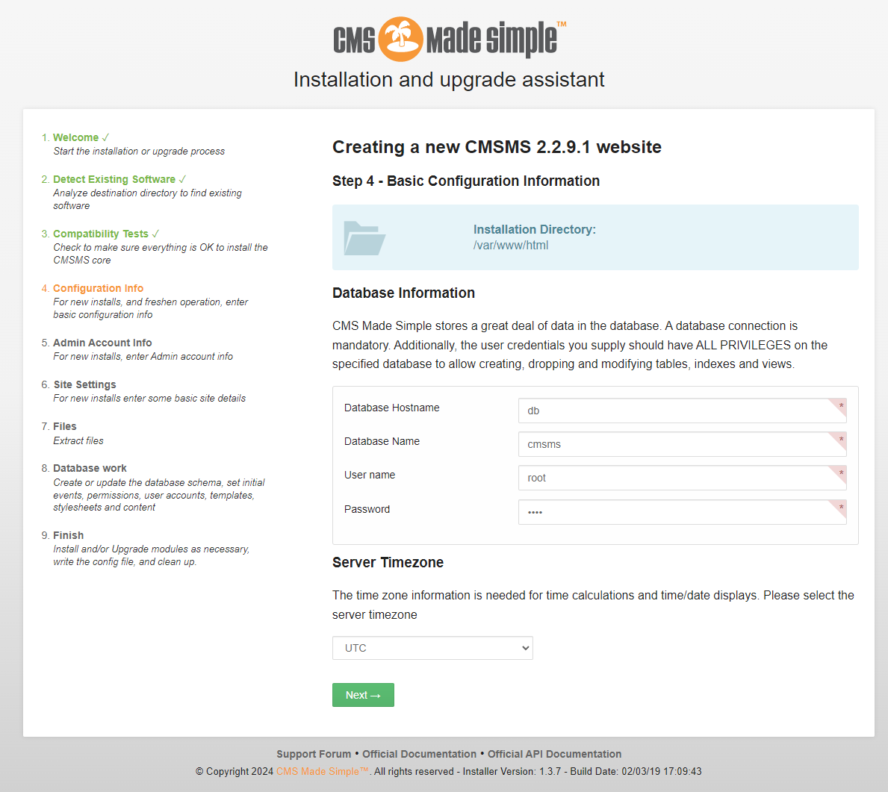
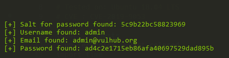

# CMS Made Simple (CMSMS) < 2.2.10 Unauthenticated SQL Injection (CVE-2019-9053)

[中文版本(Chinese version)](README.zh-cn.md)

CMS Made Simple (CMSMS) is a free, open source content management system to provide developers, programmers and site owners a web-based development and administration area.

In the version prior to 2.2.9.1, CMS Made Simple was affected by a unauthenticated SQL injection attack, which attacker is able to gain the administrator's password or password reset token. Combining the authenticated SSTI issue ([CVE-2021-26120](https://github.com/vulhub/vulhub/tree/master/cmsms/CVE-2021-26120)), could allow an attacker to execute arbitrary code on the target server.

References:

- <https://www.exploit-db.com/exploits/46635>
- <https://srcincite.io/pocs/cve-2021-26120.py.txt>

## Vulnerable Environment

Execute following command to start a CMS Made Simple 2.2.9.1:

```
docker compose up -d
```

After the server is started, you should install the CMS at `http://your-ip/install.php`.

Following the install instructions to install the CMSMS, MySQL database address is `db`, database name is `cmsms`, username and password are both `root`.



## Exploit

Use the script on <https://www.exploit-db.com/exploits/46635> to exploit the SQL injection vulnerability:

```
python2 poc.py -u http://127.0.0.1
```



As you can see, the administrator's password is exposed by SQL injection.
