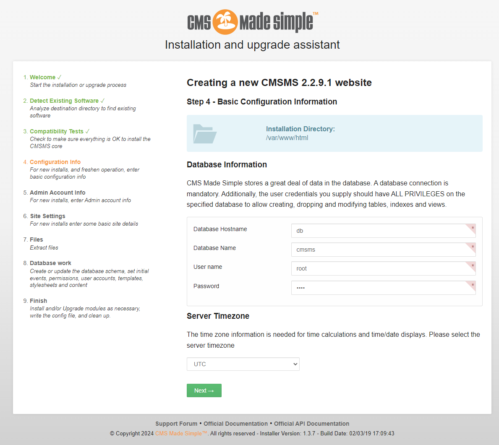

# CMS Made Simple (CMSMS) 前台代码执行漏洞（CVE-2021-26120）

CMS Made Simple（CMSMS）是一个免费的开放源码内容管理系统，为开发人员、程序员和网站所有者提供基于网络的开发和管理功能。

Smarty 3.1.39 之前的版本允许在 `{function name=` 子串后注入PHP代码，导致代码注入漏洞，该漏洞即为CVE-2021-26120。

CMS Made Simple 版本 <= 2.2.15，拥有设计师权限的用户可以在后台利用服务端模板注入漏洞，即为前面提到的CVE-2021-26120。

因此，如果CMSMS版本低于2.2.9.1，未授权的攻击者可以结合[CVE-2019-9053](https://github.com/vulhub/vulhub/tree/master/cmsms/CVE-2019-9053)和CVE-2021-26120漏洞，在服务器上执行任意代码。

参考链接：

- <https://www.exploit-db.com/exploits/46635>
- <https://srcincite.io/pocs/cve-2021-26120.py.txt>

## 漏洞环境

执行如下命令启动一个CMS Made Simple 2.2.9.1服务器：

```
docker compose up -d
```

环境启动后，你需要访问`http://your-ip/install.php`并安装CMS服务。

安装过程请根据页面中的安装向导来进行，其中MySQL数据库的地址是`db`，数据库名是`cmsms`，账号和密码均为`root`。



## 漏洞复现

使用<https://srcincite.io/pocs/cve-2021-26120.py.txt>中分享的[POC](poc.py)，可以使用SQL注入漏洞重置管理员密码，并执行任意命令：

```
python poc.py 127.0.0.1 / id
```


可见，`id`命令已被成功执行。
