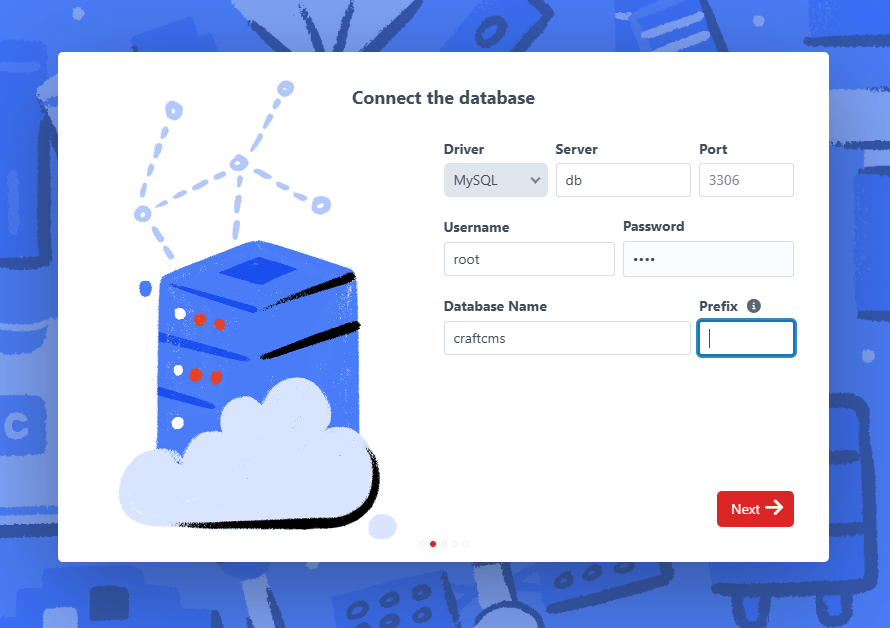
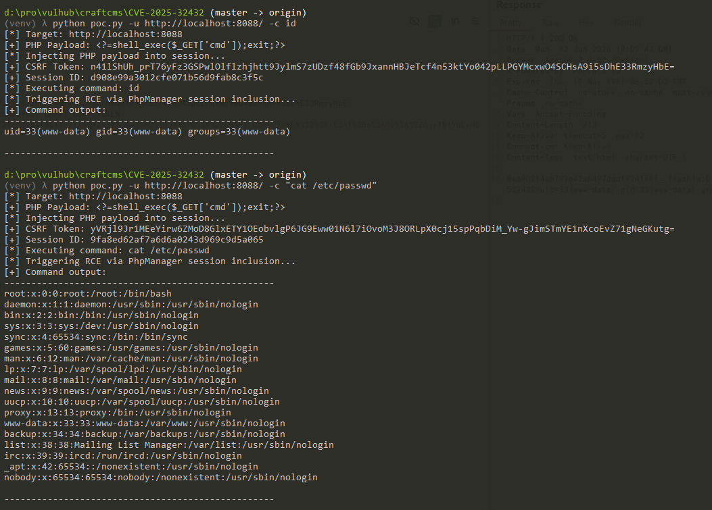

# CraftCMS Yii类注入远程代码执行漏洞（CVE-2025-32432）

CraftCMS是一个基于PHP的灵活且用户友好的内容管理系统，广泛用于创建定制化的数字体验。

CraftCMS 3.0.0-RC1至3.9.14、4.0.0-RC1至4.14.14、5.0.0-RC1至5.6.16版本的图像转换功能存在未授权远程代码执行漏洞。该漏洞位于`/actions/assets/generate-transform`端点，由于对用户输入的验证不充分，攻击者可以发送包含恶意`__class`参数的特制请求，利用Yii框架的依赖注入容器机制，在服务器上执行任意PHP代码，且无需身份验证。

参考链接：

- <https://craftcms.com/knowledge-base/craft-cms-cve-2025-32432>
- <https://www.opswat.com/blog/cve-2025-32432-unauthenticated-remote-code-execution-in-craft-cms>
- <https://github.com/CTY-Research-1/CVE-2025-32432-PoC>

## 漏洞环境

执行以下命令启动一个CraftCMS 5.6.16服务器：

```
docker compose up -d
```

服务启动后，访问`http://your-ip:8088/admin/install`可以看到安装页面。请按照提示完成CraftCMS的安装，默认数据库地址为`db`，用户名和密码均为`root`。



## 漏洞复现

该漏洞的利用采用两步请求链的方式。首先，攻击者通过发送一个GET请求，将PHP恶意代码注入到服务器的session文件中。然后，向`/actions/assets/generate-transform`端点发送第二个POST请求，通过依赖注入滥用Yii框架的`yii\rbac\PhpManager`类来包含并执行包含注入PHP代码的session文件。

使用[poc.py](poc.py)脚本来利用该漏洞。运行脚本执行`id`命令来验证漏洞：

```bash
python3 poc.py -u http://your-ip:8088 -c id
```



可以看到`id`和`cat /etc/passwd`命令被成功执行。

需要注意的是，对于CraftCMS 3.x版本，目标必须至少上传了一个资源，并且需要使用`--need-asset-id`参数来启用asset ID处理。你可以使用`-a/--asset-id`选项指定一个已知的有效asset ID，或者让脚本自动扫描（最多扫描到`--scan-max`指定的值，默认300）。对于CraftCMS 4.x和5.x版本，可能不需要此要求。针对3.x版本的示例：

```bash
python3 poc.py -u http://your-ip:8088 -c id --need-asset-id -a 1
```
