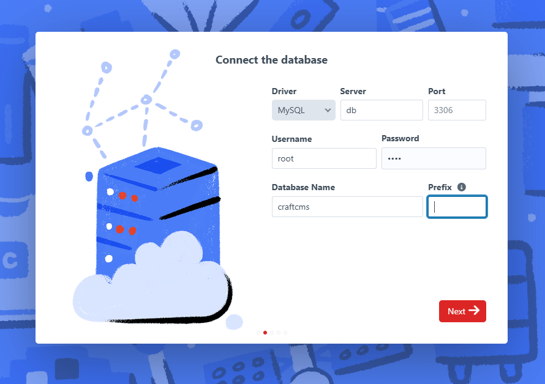
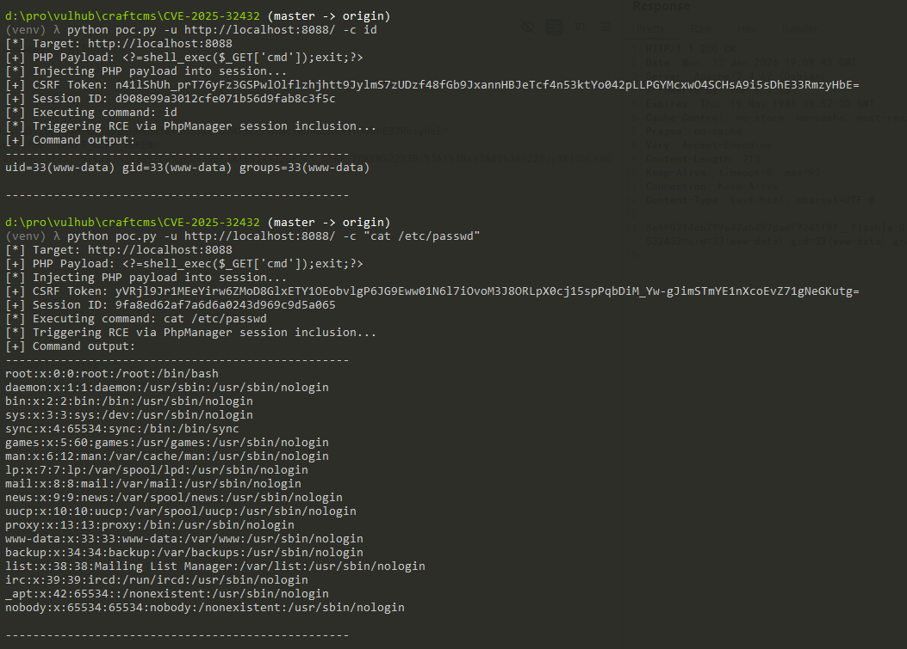

# CraftCMS Yii 类注入远程代码执行漏洞（CVE-2025-32432）

CraftCMS 是一个基于 PHP 的灵活且用户友好的内容管理系统，广泛用于创建定制化的数字体验。

CraftCMS 3.0.0-RC1 至 3.9.14、4.0.0-RC1 至 4.14.14、5.0.0-RC1 至 5.6.16 版本的图像转换功能存在未授权远程代码执行漏洞。该漏洞位于 `/actions/assets/generate-transform` 端点，由于对用户输入的验证不充分，攻击者可以发送包含恶意 `__class` 参数的特制请求，利用 Yii 框架的依赖注入容器机制，在服务器上执行任意 PHP 代码，且无需身份验证。

参考链接：

- <https://craftcms.com/knowledge-base/craft-cms-cve-2025-32432>
- <https://www.opswat.com/blog/cve-2025-32432-unauthenticated-remote-code-execution-in-craft-cms>
- <https://github.com/CTY-Research-1/CVE-2025-32432-PoC>

## 漏洞环境

执行以下命令启动一个 CraftCMS 5.6.16 服务器：

```
docker compose up -d
```

服务启动后，访问 `http://your-ip:8088/admin/install` 可以看到安装页面。请按照提示完成 CraftCMS 的安装，默认数据库地址为 `db`，用户名和密码均为 `root`。



## 漏洞复现

该漏洞的利用采用两步请求链的方式。首先，攻击者通过发送一个 GET 请求，将 PHP 恶意代码注入到服务器的 session 文件中。然后，向 `/actions/assets/generate-transform` 端点发送第二个 POST 请求，通过依赖注入滥用 Yii 框架的 `yii\rbac\PhpManager` 类来包含并执行包含注入 PHP 代码的 session 文件。

使用 [poc.py](poc.py) 脚本来利用该漏洞。运行脚本执行 `id` 命令来验证漏洞：

```bash
python3 poc.py -u http://your-ip:8088 -c id
```



可以看到 `id` 和 `cat /etc/passwd` 命令被成功执行。

需要注意的是，对于 CraftCMS 3.x 版本，目标必须至少上传了一个资源，并且需要使用 `--need-asset-id` 参数来启用 asset ID 处理。你可以使用 `-a/--asset-id` 选项指定一个已知的有效 asset ID，或者让脚本自动扫描（最多扫描到 `--scan-max` 指定的值，默认 300）。对于 CraftCMS 4.x 和 5.x 版本，可能不需要此要求。针对 3.x 版本的示例：

```bash
python3 poc.py -u http://your-ip:8088 -c id --need-asset-id -a 1
```
