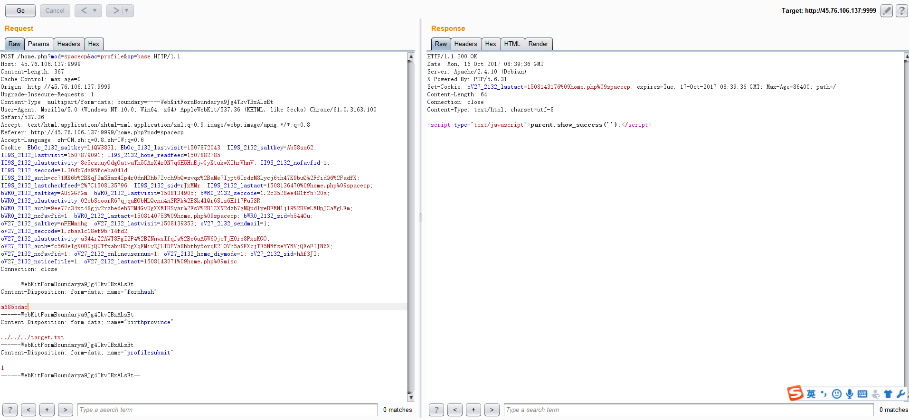
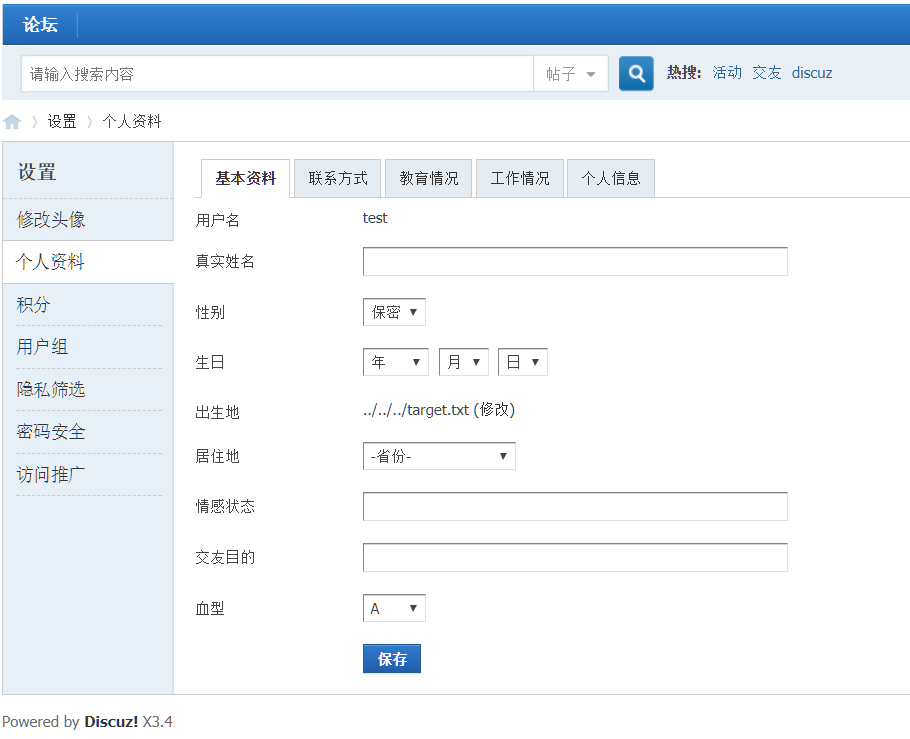

# Discuz!X ≤3.4 任意文件删除漏洞

影响版本：Discuz!X ≤3.4  漏洞详情：https://lorexxar.cn/2017/09/30/dz-delete/

# 环境
执行下列命令部署Discuz!X 安装环境

    docker-compose build
    docker-compose up -d

在镜像完成部署后使用下列命令获取数据库IP以便后面安装。

    docker inspect -f '{{range .NetworkSettings.Networks}}{{.IPAddress}}{{end}}' $container_name_or_id

数据库地址为上面的命令获得的地址，数据库名为：`DISCUZX`。用户名可用`root`或`DISCUZX`，口令是`DISCUZX`。

# POC
注册用户后进入用户资料修改页面，在

