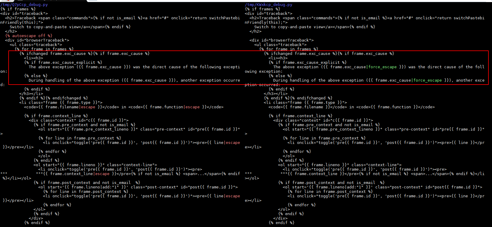
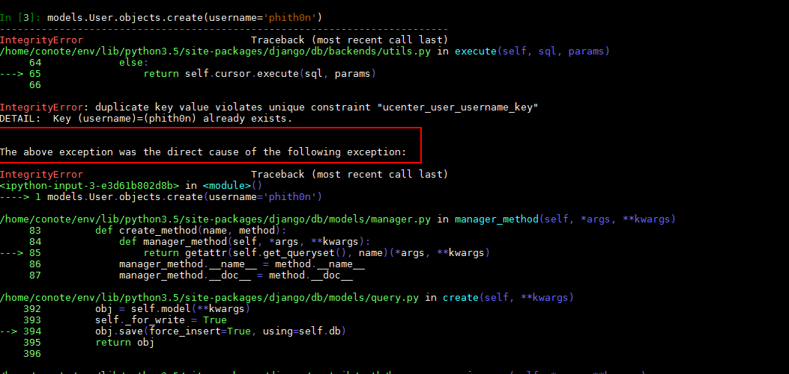
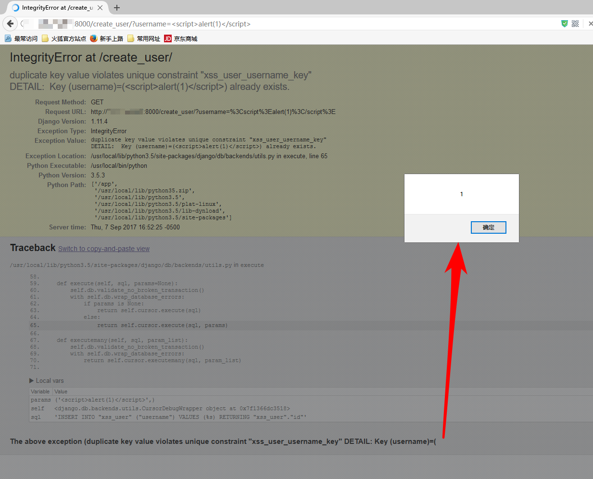

# Django debug page XSS漏洞（CVE-2017-12794）分析

Django发布了新版本1.11.5，修复了500页面中可能存在的一个XSS漏洞，这篇文章说明一下该漏洞的原理和复现，和我的一点点评。

## 0x01 补丁分析

因为官方说明是500页面中出现的BUG，所以我们重点关注的就是`django/views/debug.py`。

Github上有Django的仓库，下载下来，用1.11.4和1.11.5进行比较：

```bash
git clone https://github.com/django/django.git
cd django
git diff 1.11.4 1.11.5 django/views/debug.py
```



可见，外部关闭了全局转义，然后在这两个地方增加了强制转义。那么，漏洞肯定是在这个位置触发的。

## 0x02 功能点探索

如果要触发这两个输出点，就必须进入这个if语句：``。

首先我们来想一下，正常情况下，这个位置是干嘛用的，也就是说，功能点是什么。

作为一个老年Django开发，看到上图画框的这个关键句子`The above exception was the direct cause of the following exception:`，我是有印象的：一般是在出现数据库异常的时候，会抛出这样的错误语句。

我们可以做个简单的测试，在Django命令行下，我们创建一个username为phith0n的用户，然后再次创建一个username为phith0n的用户，则会抛出一个`IntegrityError`异常：



见上图，原因是触发了数据库的Unique异常。

为什么Django会引入这样一个异常机制？这是为了方便开发者进行SQL错误的调试，因为Django的模型最终是操作数据库，数据库中具体出现什么错误，是Django无法100%预测的。那么，为了方便开发者快速找到是哪个操作触发了数据库异常，就需要将这两个异常回溯栈关联到一块。

我们可以看看代码，`django/db/utils.py`的`__exit__`函数：

```python
def __exit__(self, exc_type, exc_value, traceback):
    if exc_type is None:
        return
    for dj_exc_type in (
            DataError,
            OperationalError,
            IntegrityError,
            InternalError,
            ProgrammingError,
            NotSupportedError,
            DatabaseError,
            InterfaceError,
            Error,
    ):
        db_exc_type = getattr(self.wrapper.Database, dj_exc_type.__name__)
        if issubclass(exc_type, db_exc_type):
            dj_exc_value = dj_exc_type(*exc_value.args)
            dj_exc_value.__cause__ = exc_value
            if not hasattr(exc_value, '__traceback__'):
                exc_value.__traceback__ = traceback
            # Only set the 'errors_occurred' flag for errors that may make
            # the connection unusable.
            if dj_exc_type not in (DataError, IntegrityError):
                self.wrapper.errors_occurred = True
            six.reraise(dj_exc_type, dj_exc_value, traceback)
```

其中`exc_type`是异常，如果其类型是`DataError,OperationalError,IntegrityError,InternalError,ProgrammingError,NotSupportedError,DatabaseError,InterfaceError,Error`之一，则抛出一个同类型的新异常，并设置其`__cause__`和`__traceback__`为此时上下文的`exc_value`和`traceback`。

`exc_value`是上一个异常的说明，`traceback`是上一个异常的回溯栈。这个函数其实就是关联了上一个异常和当前的新异常。

最后，在500页面中，`__cause__`被输出。

## 0x03 漏洞复现

经过我的测试，我发现在使用Postgres数据库并触发异常的时候，psycopg2会将字段名和字段值全部抛出。那么，如果字段值中包含我们可控的字符串，又由于0x02中说到的，这个字符串其实就会被设置成`__cause__`，最后被显示在页面中。

所以我们假设有如下场景：

1. 用户注册页面，未检查用户名
2. 注册一个用户名为`<script>alert(1)</script>`的用户
3. 再次注册一个用户名为`<script>alert(1)</script>`的用户
4. 触发duplicate key异常，导致XSS漏洞

我将上述流程整理成vulhub的一个环境：https://github.com/phith0n/vulhub/tree/master/django/CVE-2017-12794

编译及启动环境：

```
docker-compose up -d
```

访问`http://your-ip:8000/create_user/?username=<script>alert(1)</script>`创建一个用户，成功；再次访问`http://your-ip:8000/create_user/?username=<script>alert(1)</script>`，触发异常：



可见，Postgres抛出的异常为

```
duplicate key value violates unique constraint "xss_user_username_key"
DETAIL:  Key (username)=(<script>alert(1)</script>) already exists.
```

这个异常被拼接进`The above exception ({{ frame.exc_cause }}) was the direct cause of the following exception`，最后触发XSS。
