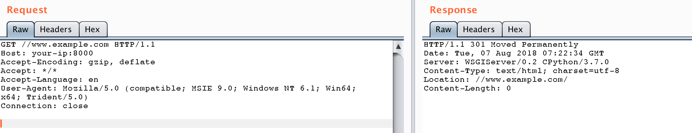

# Django < 2.0.8 Open redirect possibility in CommonMiddleware (CVE-2018-14574)

[中文版本(Chinese version)](README.zh-cn.md)

If the `django.middleware.common.CommonMiddleware` and the `APPEND_SLASH` setting are both enabled, and if the project has a URL pattern that accepts any path ending in a slash, then a request to a maliciously crafted URL of that site could lead to a redirect to another site, enabling phishing and other attacks.

## Vulnerability environment

Start the environment with Django 2.0.7:

```
docker-compose build
docker-compose up -d
```

## Exploit

Now visit `http://your-ip:8000//www.example.com`, you will be redirected to `//www.example.com/`：


