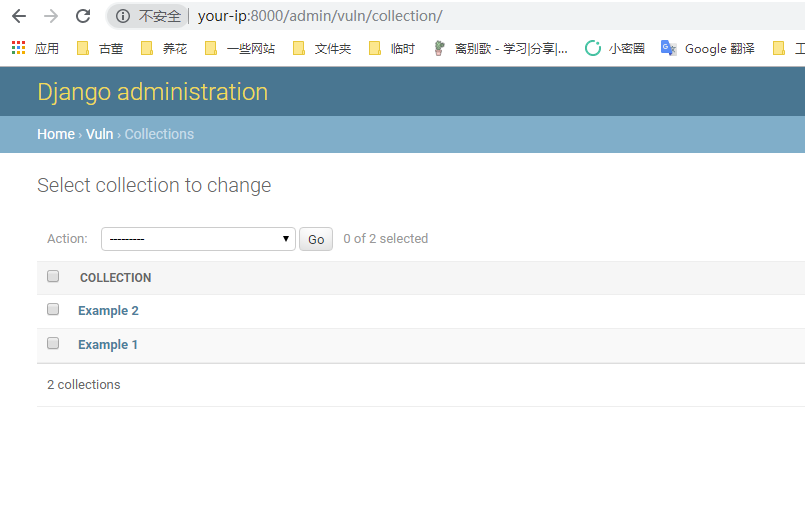
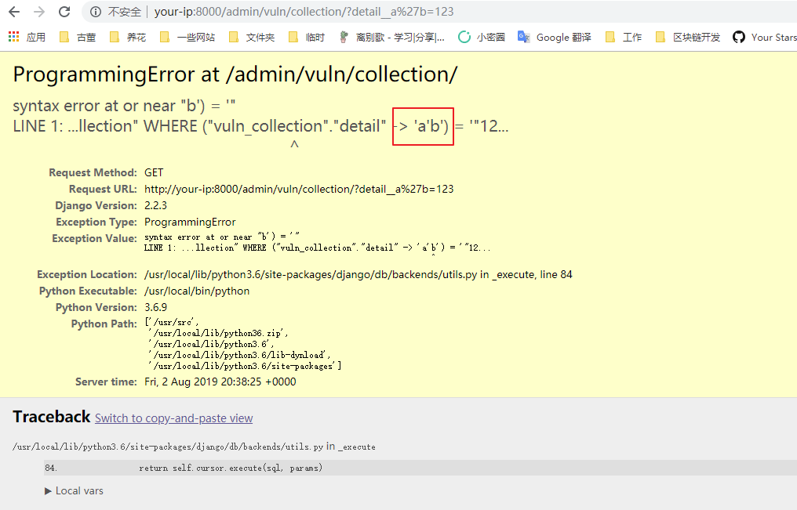

# Django JSONField/HStoreField SQL 注入漏洞（CVE-2019-14234）

Django 是一个高级的 Python Web 框架，支持快速开发和简洁实用的设计。

Django 在 2019 年 8 月 1 日发布了安全更新，修复了在 JSONField 和 HStoreField 两个模型字段中存在的 SQL 注入漏洞。该漏洞影响 Django 2.2.4、2.1.11 和 1.11.23 之前的版本。

该漏洞需要开发者使用了 JSONField/HStoreField，且用户可以控制查询集中的键名。Django 的内置管理界面受此漏洞影响，这为我们提供了一个简单的漏洞演示方法。

参考链接：

- <https://www.djangoproject.com/weblog/2019/aug/01/security-releases/>
- <https://www.leavesongs.com/PENETRATION/django-jsonfield-cve-2019-14234.html>

## 环境搭建

执行如下命令编译并启动一个存在漏洞的 Django 2.2.3 服务器：

```
docker compose build
docker compose up -d
```

环境启动后，访问 `http://your-ip:8000` 即可看到 Django 默认首页。

## 漏洞复现

首先使用以下凭据登录 Django 管理界面 `http://your-ip:8000/admin/`：

- 用户名：`admin`
- 密码：`a123123123`

导航到 Collection 模型的列表视图 `http://your-ip:8000/admin/vuln/collection/`：



要利用 SQL 注入漏洞，在 GET 参数中添加 `detail__a'b=123`，其中 `detail` 是 JSONField 字段：

```
http://your-ip:8000/admin/vuln/collection/?detail__a%27b=123
```

SQL 错误信息将会显示，证实注入成功：


