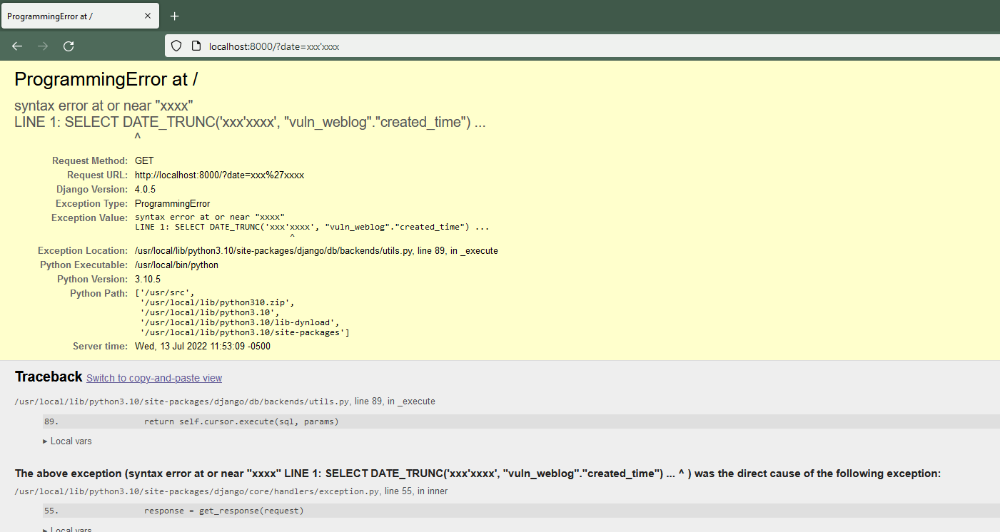

# Django Trunc(kind) and Extract(lookup_name) SQL Injection (CVE-2022-34265)

[中文版本(Chinese version)](README.zh-cn.md)

Django is a high-level Python web framework that encourages rapid development and clean, pragmatic design.

Django released a security update on July 4, 2022, which fixes a SQL injection vulnerability in the Trunc() and Extract() database functions. This vulnerability affects Django versions before 4.0.6, 3.2.14.

References:

- https://www.djangoproject.com/weblog/2022/jul/04/security-releases/
- https://github.com/django/django/commit/0dc9c016fadb71a067e5a42be30164e3f96c0492

## Environment Setup

Execute the following command to start a vulnerable Django 4.0.5 server:

```
docker compose up -d
```

After the server is started, you can access the web page at `http://your-ip:8000`.

## Vulnerability Reproduction

The web application uses the `Trunc` function to aggregate page click counts by datetime. Visit `http://your-ip:8000/?date=minute` to see the number of clicks per minute:


To exploit the SQL injection vulnerability, modify the `date` parameter with malicious input:

```
http://your-ip:8000/?date=xxxx'xxxx
```

The SQL error message will be displayed, confirming the successful injection:


