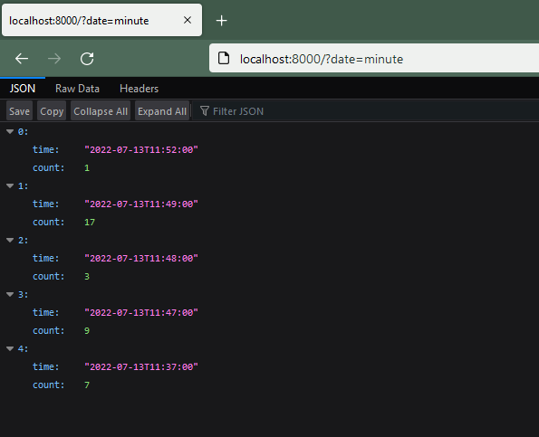

# Django Trunc(kind) and Extract(lookup_name) SQL注入漏洞（CVE-2022-34265）

[中文版本(Chinese version)](README.zh-cn.md)

Django在2022年7月4日发布了安全更新，修复了在数据库函数`Trunc()`和`Extract()`中存在的SQL注入漏洞。

参考链接：

- https://www.djangoproject.com/weblog/2022/jul/04/security-releases/

## 漏洞环境

启动一个Django 4.0.5版本的服务器：

```
docker-compose up -d
```

环境启动后，你可以在`http://your-ip:8000`看到一个页面。这个页面使用了Trunc函数来聚合页面点击数量，比如使用`http://your-ip:8000/?date=minute`即可看到按照分钟聚合的点击量：



## 漏洞复现

修改`date`参数即可复现SQL注入漏洞：

```
http://your-ip:8000/?date=xxxx'xxxx
```


